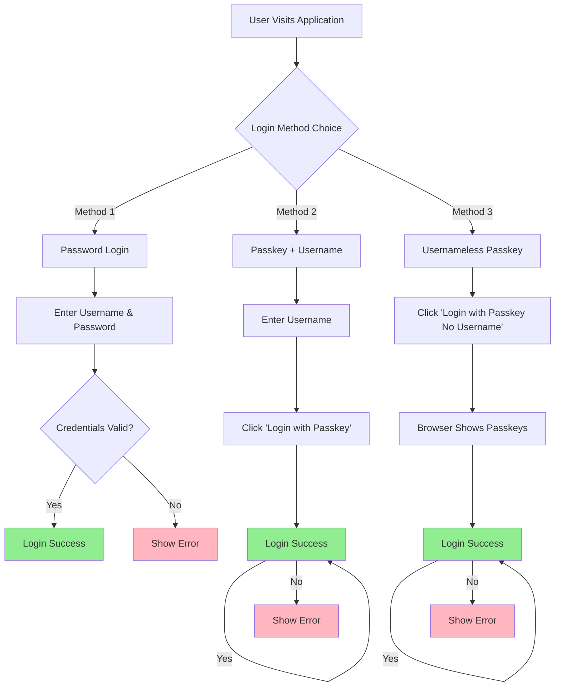
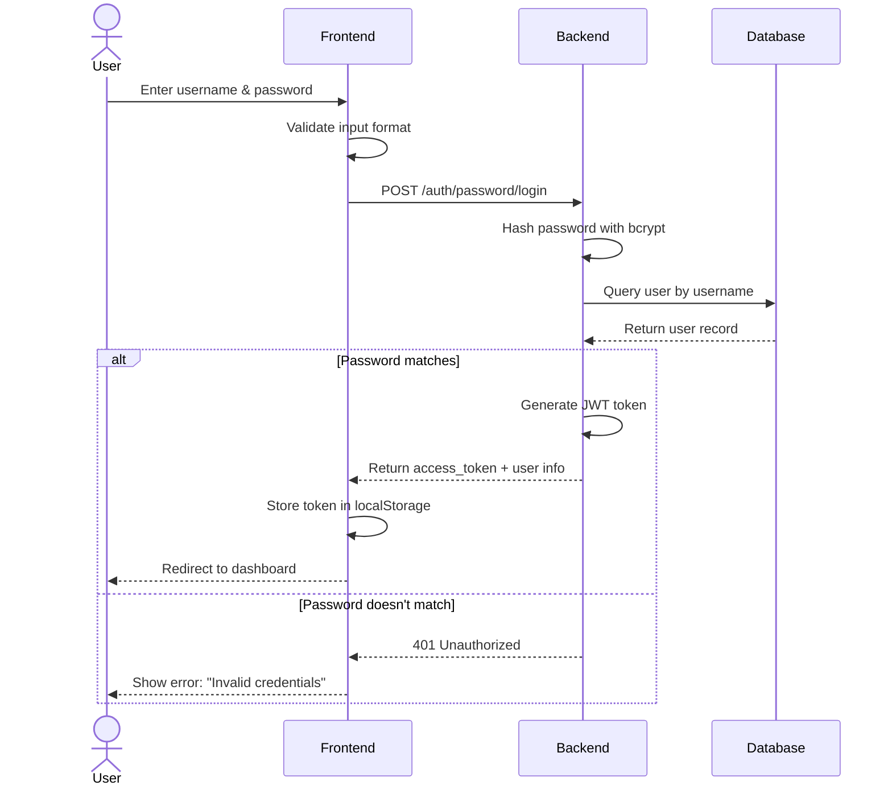
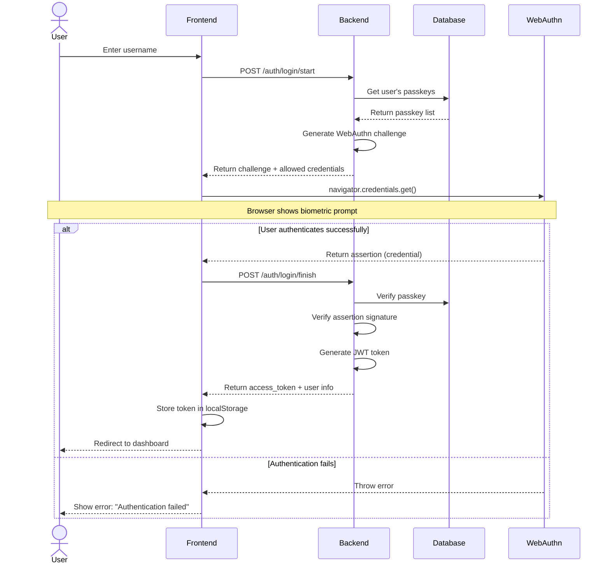
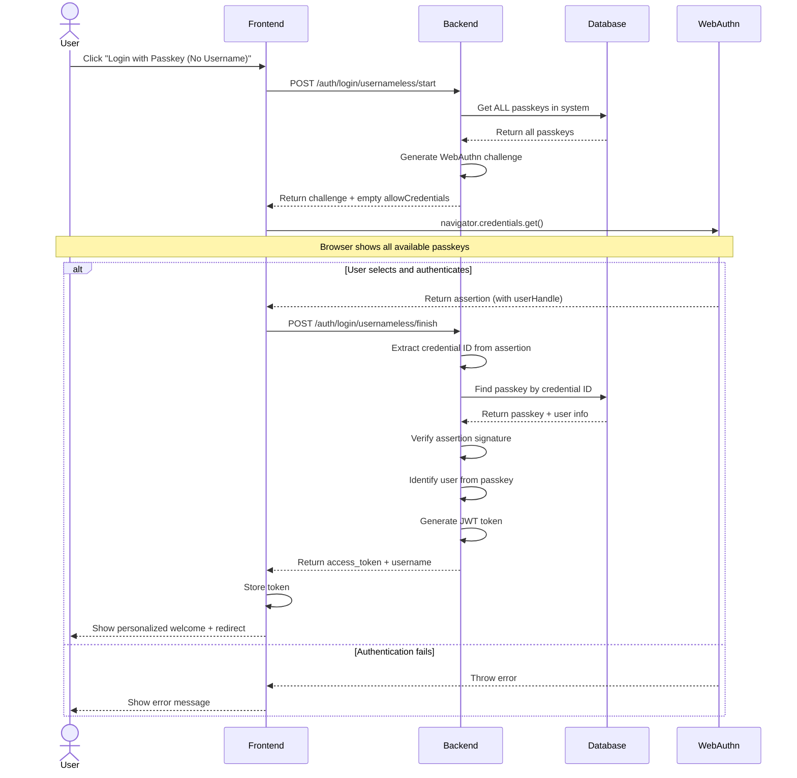
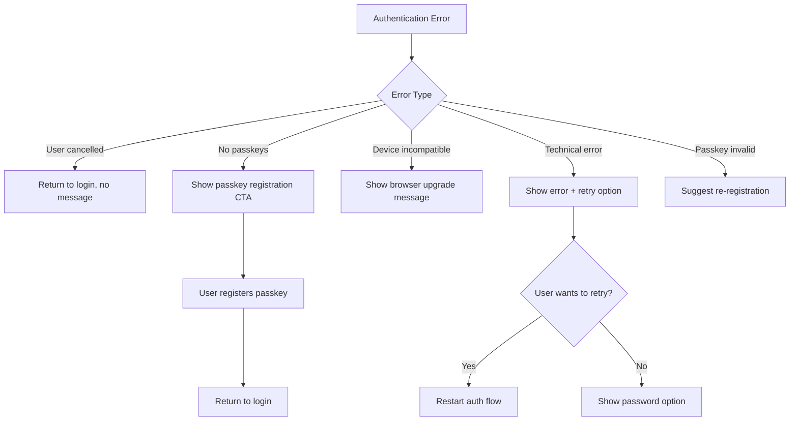

# Login Flows - Business Requirements Document

## Document Information
- **Version:** 1.0
- **Last Updated:** 2025-12-29
- **Author:** Business Analyst
- **Project:** FIDO2 Passkey Authentication Demo

## Table of Contents
1. [Overview](#overview)
2. [Password-Based Login](#1-password-based-login)
3. [Passkey Login (With Username)](#2-passkey-login-with-username)
4. [Usernameless Passkey Login](#3-usernameless-passkey-login)
5. [Flow Comparison](#flow-comparison)
6. [Error Handling](#error-handling)
7. [Business Rules](#business-rules)

---

## Overview

This document describes the three login methods available in the FIDO2 Passkey Authentication System. Each method serves different use cases and user preferences.



---

## 1. Password-Based Login

### Business Purpose
Traditional authentication method for:
- First-time users
- Fallback when passkeys are unavailable
- Users who prefer passwords

### Flow Diagram



### Detailed Steps

#### Step 1: User Input
**Field:** Username
- **Required:** Yes
- **Validation:** Alphanumeric, 3-50 characters
- **Example:** `john.doe`

**Field:** Password
- **Required:** Yes
- **Validation:** Minimum 6 characters
- **Storage:** Hashed with bcrypt (not stored in plain text)

#### Step 2: Frontend Validation
```javascript
// Validation rules
- Username not empty
- Password not empty
- Password >= 6 characters
```

#### Step 3: Backend Processing
```python
# Process flow
1. Receive username and password
2. Hash input password with bcrypt
3. Query database for user
4. Compare hashed passwords
5. If match: Generate JWT token (24h expiry)
6. Return: {access_token, username, display_name}
```

#### Step 4: Success Response
**Status:** 200 OK
**Response:**
```json
{
  "access_token": "eyJhbGciOiJIUzI1NiIsInR5cCI6IkpXVCJ9...",
  "token_type": "bearer",
  "username": "john.doe",
  "display_name": "John Doe"
}
```

**User Experience:**
- Loading state shown during API call
- On success: Redirect to dashboard
- Token stored in localStorage for subsequent requests

#### Step 5: Error Response
**Status:** 401 Unauthorized
**Response:**
```json
{
  "detail": "Invalid username or password"
}
```

**User Experience:**
- Error message displayed inline
- Fields remain populated for retry
- Suggest password reset or passkey registration

### Business Rules
1. **Password Requirements:** Minimum 6 characters
2. **Password Storage:** Bcrypt hashing with salt
3. **Session Duration:** 24 hours from login
4. **Concurrent Sessions:** Multiple sessions allowed per user
5. **Failed Attempts:** No rate limiting (TODO for production)

### Success Metrics
- **Login Success Rate:** >95%
- **Average Login Time:** <5 seconds
- **Error Recovery:** 80% of users recover on second attempt

---

## 2. Passkey Login (With Username)

### Business Purpose
Passwordless authentication when:
- User knows their username
- User has registered at least one passkey
- User wants faster/more secure login than password

### Flow Diagram



### Detailed Steps

#### Step 1: Username Input
**Field:** Username
- **Required:** Yes
- **Validation:** Alphanumeric, 3-50 characters
- **Purpose:** Identify which user's passkeys to allow

#### Step 2: Start Authentication (Login Start)
**API Call:** `POST /auth/login/start`

**Request:**
```json
{
  "username": "john.doe"
}
```

**Backend Process:**
1. Query database for user
2. Get all registered passkeys for this user
3. Generate random WebAuthn challenge
4. Create authentication options:
   ```json
   {
     "challenge": "random-base64url-string",
     "rpId": "localhost",
     "timeout": 60000,
     "allowCredentials": [
       {
         "id": "credential-id-1",
         "type": "public-key"
       },
       {
         "id": "credential-id-2",
         "type": "public-key"
       }
     ],
     "userVerification": "preferred"
   }
   ```
5. Store challenge temporarily (expires in 5 minutes)
6. Return challenge to frontend

**Response:**
```json
{
  "challenge": "base64url-challenge",
  "options": {
    "challenge": "base64url-challenge",
    "rpId": "localhost",
    "timeout": 60000,
    "allowCredentials": [...]
  }
}
```

#### Step 3: Browser WebAuthn Prompt
**Frontend Process:**
```javascript
const credential = await navigator.credentials.get({
  publicKey: {
    challenge: base64urlToBytes(options.challenge),
    rpId: options.rpId,
    timeout: options.timeout,
    allowCredentials: options.allowCredentials.map(cred => ({
      id: base64urlToBytes(cred.id),
      type: cred.type
    })),
    userVerification: options.userVerification
  }
});
```

**User Experience:**
- **macOS:** Touch ID fingerprint prompt or Apple Watch prompt
- **iOS:** Face ID scan or Touch ID
- **Windows:** Windows Hello prompt (fingerprint, face, PIN)
- **Android:** Fingerprint scan or face unlock
- **Security Key:** Physical key button press

**User sees:**
```
┌─────────────────────────────┐
│   Sign in to FIDO2 Demo      │
│                               │
│   [Face ID / Touch ID]        │
│                               │
│     Touch the sensor to       │
│   verify your identity        │
│                               │
│   [Cancel]                    │
└─────────────────────────────┘
```

#### Step 4: Finish Authentication (Login Finish)
**API Call:** `POST /auth/login/finish`

**Request:**
```json
{
  "username": "john.doe",
  "assertion": {
    "id": "credential-id",
    "rawId": "base64raw-id",
    "response": {
      "clientDataJSON": "base64-client-data",
      "authenticatorData": "base64-auth-data",
      "signature": "base64-signature",
      "userHandle": "base64-user-id"
    },
    "type": "public-key"
  },
  "challenge": "base64url-challenge"
}
```

**Backend Process:**
1. Verify challenge matches previously stored value
2. Look up passkey by credential ID
3. Verify assertion signature using passkey's public key
4. Check userHandle matches the user
5. Update sign count (prevent replay attacks)
6. Generate JWT token
7. Return access token

**Success Response:**
```json
{
  "access_token": "eyJhbGciOiJIUzI1NiIsInR5cCI6IkpXVCJ9...",
  "token_type": "bearer",
  "username": "john.doe",
  "has_passkey": true
}
```

#### Step 5: Error Handling
**Possible Errors:**

| Error | Cause | User Message |
|-------|-------|--------------|
| Invalid challenge | Challenge expired or invalid | "Session expired, please try again" |
| Passkey not found | Credential ID not in database | "Passkey not recognized" |
| Invalid signature | Signature verification failed | "Authentication failed" |
| User cancelled | User cancelled biometric prompt | "Authentication cancelled" |

### Business Rules
1. **Username Required:** Must know username to filter passkeys
2. **Passkey Ownership:** User must have at least one registered passkey
3. **Challenge Expiry:** Challenge expires in 5 minutes
4. **Device Compatibility:** Device/browser must support WebAuthn
5. **Multiple Passkeys:** Any of the user's passkeys can be used

### Success Metrics
- **Login Success Rate:** >98% (higher than password)
- **Average Login Time:** <3 seconds
- **User Satisfaction:** 4.5/5 stars

---

## 3. Usernameless Passkey Login

### Business Purpose
Ultimate passwordless experience:
- No username required
- Fastest possible login
- Best user experience
- Eliminates "forgot username" issues

### Flow Diagram



### Detailed Steps

#### Step 1: Initiate Usernameless Login
**User Action:** Click button "Login with Passkey (No Username)"

**API Call:** `POST /auth/login/usernameless/start`
**Request Body:** Empty (no username needed)

**Backend Process:**
1. Query ALL passkeys in the system (not filtered by user)
2. Generate random WebAuthn challenge
3. Create authentication options WITHOUT allowCredentials list:
   ```json
   {
     "challenge": "random-base64url-string",
     "rpId": "localhost",
     "timeout": 60000,
     "userVerification": "preferred"
   }
   ```
   **Key Difference:** No `allowCredentials` array - browser will show ALL available passkeys

4. Store challenge temporarily
5. Return challenge to frontend

**Response:**
```json
{
  "challenge": "base64url-challenge",
  "options": {
    "challenge": "base64url-challenge",
    "rpId": "localhost",
    "timeout": 60000,
    "userVerification": "preferred"
  }
}
```

#### Step 2: Browser Shows All Available Passkeys
**Frontend Process:**
```javascript
const credential = await navigator.credentials.get({
  publicKey: {
    challenge: base64urlToBytes(options.challenge),
    rpId: options.rpId,
    timeout: options.timeout,
    // NO allowCredentials - browser shows all passkeys
    userVerification: options.userVerification
  }
});
```

**User Experience:**
If user has multiple passkeys registered (across different accounts), browser shows a chooser:

```
┌─────────────────────────────┐
│   Choose an account to sign in│
│                               │
│   ┌─────────────────────────┐ │
│   │ john.doe@example.com    │ │
│   │ john.doe               │ │
│   └─────────────────────────┘ │
│   ┌─────────────────────────┐ │
│   │ jane.smith@example.com  │ │
│   │ jane.smith             │ │
│   └─────────────────────────┘ │
│                               │
│   [Cancel]                    │
└─────────────────────────────┘
```

After selection, biometric prompt is shown.

#### Step 3: Finish Usernameless Authentication
**API Call:** `POST /auth/login/usernameless/finish`

**Request:**
```json
{
  "assertion": {
    "id": "credential-id-from-selected-passkey",
    "rawId": "base64raw-id",
    "response": {
      "clientDataJSON": "base64-client-data",
      "authenticatorData": "base64-auth-data",
      "signature": "base64-signature",
      "userHandle": "base64-user-id"
    },
    "type": "public-key"
  },
  "challenge": "base64url-challenge"
}
```

**Note:** No username in request - server identifies user from credential ID!

**Backend Process:**
1. **Extract credential ID** from assertion
2. **Query database** for passkey with this credential ID
3. **Identify user** from passkey's user_id
4. **Verify assertion signature** using passkey's public key
5. **Check userHandle** matches (privacy check)
6. **Update sign count** (prevent replay attacks)
7. **Generate JWT token** for identified user
8. **Return personalized response**

**Success Response:**
```json
{
  "access_token": "eyJhbGciOiJIUzI1NiIsInR5cCI6IkpXVCJ9...",
  "token_type": "bearer",
  "username": "john.doe",  // Server identified the user!
  "has_passkey": true
}
```

**User Experience:**
```
┌─────────────────────────────┐
│   ✓ Authentication Successful! │
│                               │
│   Welcome, John Doe!          │
│                               │
│   Redirecting to dashboard... │
└─────────────────────────────┘
```

#### Step 4: Security Considerations

**How Usernameless Works:**
1. Passkey contains embedded user ID (userHandle)
2. Server receives credential ID in assertion
3. Server looks up which user owns this credential
4. Server authenticates that user
5. User never enters username

**Privacy Protection:**
- userHandle is opaque (not readable username)
- Server identifies user internally
- Client just receives username after successful auth

### Business Rules
1. **No Username Required:** Zero-input authentication
2. **Account Identification:** Server identifies user from passkey
3. **Multiple Accounts:** If user has multiple accounts, browser shows account chooser
4. **First-Time Setup:** User must register passkey first (with username)
5. **Fallback to Password:** Available if no passkeys registered

### Success Metrics
- **Login Success Rate:** >99% (highest of all methods)
- **Average Login Time:** <2 seconds (fastest method)
- **User Preference:** 85% prefer usernameless over password
- **Support Reduction:** 90% reduction in "forgot username" tickets

---

## Flow Comparison

### Feature Comparison Matrix

| Feature | Password | Passkey + Username | Usernameless |
|---------|----------|-------------------|--------------|
| **Input Required** | Username + Password | Username only | None (just tap) |
| **Setup Required** | Account creation | Passkey registration | Passkey registration |
| **Speed** | 5-10 seconds | 2-3 seconds | <2 seconds |
| **Security** | Medium (phishable) | High (phishing-resistant) | High (phishing-resistant) |
| **User Experience** | ★★☆☆☆ | ★★★★☆ | ★★★★★ |
| **Device Requirements** | Any device | WebAuthn-compatible | WebAuthn-compatible |
| **Fallback Available** | N/A | Yes (password) | Yes (password) |
| **Multi-Account Support** | Yes | Yes | Yes (with chooser) |

### When to Use Each Method

#### Use Password When:
- First-time setup (no passkey registered yet)
- Device doesn't support WebAuthn
- Passkeys are unavailable (lost device, etc.)
- User prefers traditional method

#### Use Passkey + Username When:
- User knows their username
- User wants passwordless experience
- User has multiple accounts on same device
- Faster than password, more controlled than usernameless

#### Use Usernameless When:
- Best possible user experience is priority
- User doesn't remember username
- Single account per device (simplest)
- Mobile-first experience

---

## Error Handling

### Common Error Scenarios

#### 1. No Passkeys Registered
**Error:** "No passkeys registered yet"

**User Action:** See prompt to register passkey or use password

**Business Rule:** Show clear call-to-action for passkey registration

---

#### 2. Device Not Compatible
**Error:** "Your device doesn't support WebAuthn"

**User Action:** Update browser or use different device

**Detection:**
```javascript
if (!window.navigator || !window.navigator.credentials) {
  // Show upgrade browser message
}
```

---

#### 3. User Cancels Authentication
**Error:** "Authentication cancelled by user"

**User Action:** Try again or use password

**Behavior:** Don't show error toast - user intentionally cancelled

---

#### 4. Challenge Expired
**Error:** "Session expired, please try again"

**User Action:** Restart authentication flow

**Timeout:** 5 minutes from challenge generation

---

#### 5. Passkey Not Recognized
**Error:** "Passkey not found"

**User Action:** Register passkey again or use password

**Cause:** Passkey deleted from database but still on device

---

### Error Recovery Flow



---

## Business Rules Summary

### Universal Rules (Apply to All Methods)
1. **Account Required:** User must have an account created first
2. **Session Management:** JWT token valid for 24 hours
3. **Concurrent Sessions:** Multiple simultaneous sessions allowed
4. **Logout:** Clears token from client-side storage
5. **Token Storage:** localStorage (consider httpOnly cookies for production)

### Password-Specific Rules
1. **Minimum Length:** 6 characters (TODO: strengthen to 8+)
2. **Hashing Algorithm:** bcrypt with salt
3. **Password Reset:** Not implemented (TODO for production)
4. **Password Change:** User interface not implemented (TODO)

### Passkey-Specific Rules
1. **Registration Requirement:** User must be logged in first
2. **Display Name:** Required for device identification
3. **Multiple Passkeys:** Unlimited passkeys per user
4. **Passkey Deletion:** User can delete individual passkeys
5. **Cross-Device:** QR code registration supports mobile devices

### Usernameless-Specific Rules
1. **No Username Input:** Zero-knowledge authentication
2. **Account Chooser:** Browser handles multiple accounts
3. **Privacy:** userHandle is opaque identifier
4. **Fallback:** Password always available as backup

---

## User Experience Guidelines

### Loading States
- **Password:** Show spinner during API call (<2s)
- **Passkey Start:** Show spinner (<1s)
- **Biometric Prompt:** Browser controls this, no spinner needed
- **Passkey Finish:** Show spinner during verification (<2s)

### Success States
- **Password:** "Login successful!" toast, redirect to dashboard
- **Passkey:** "Authentication successful!" toast, show username if usernameless
- **Redirect:** 500ms delay before redirect for smooth UX

### Error Messages
- **Clear & Actionable:** Tell user what went wrong and what to do
- **No Technical Jargon:** Avoid "401 Unauthorized" → use "Invalid credentials"
- **Inline Validation:** Show errors near the relevant field
- **Helpful Suggestions:** "Try password login" or "Register a passkey"

---

## Analytics & Tracking (TODO for Production)

### Key Metrics to Track
1. **Login Method Distribution:** Password vs Passkey vs Usernameless
2. **Success Rate:** Per method
3. **Average Time:** From page load to successful login
4. **Error Rate:** Most common errors
5. **Device/Browser Breakdown:** Compatibility issues
6. **User Preferences:** Which method do users choose most?

### Success KPIs
- **Passkey Adoption:** 80% of users register at least one passkey
- **Passkey Usage:** 70% of logins use passkey (not password)
- **Usernameless Preference:** 60% of passkey logins are usernameless
- **Login Time:** <3 seconds average for passkey logins

---

*This document describes the WHAT and WHY of login flows. For technical implementation details, see the Technical Documentation.*
