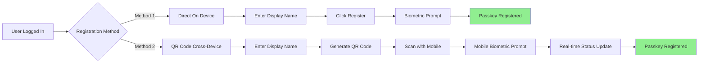
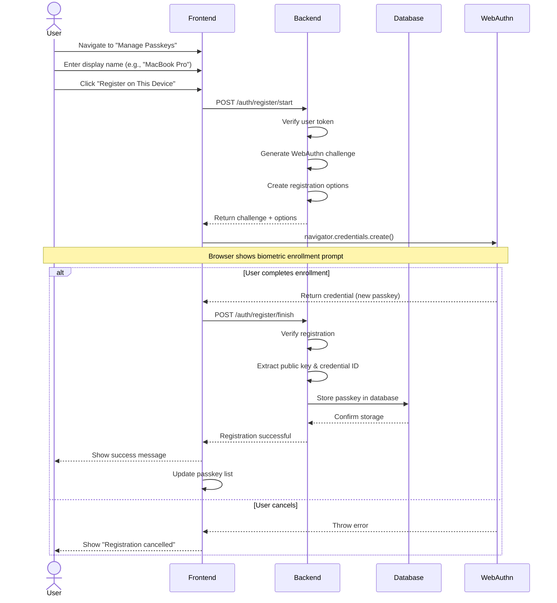
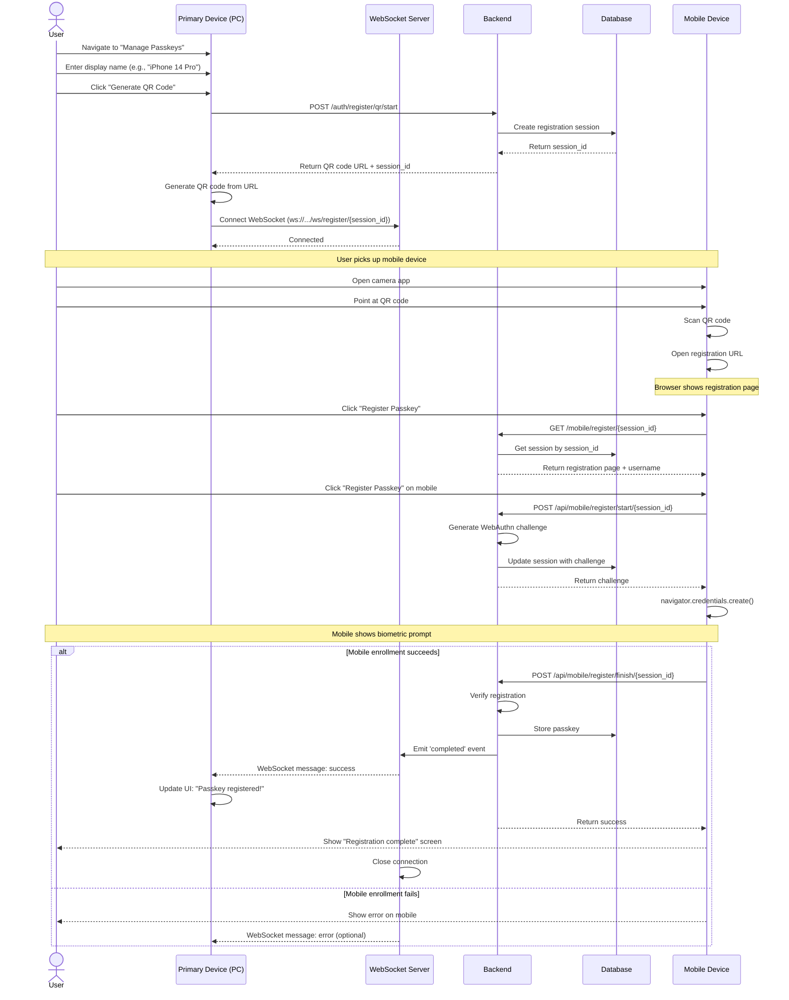

# Passkey Registration Flows - Business Requirements Document

## Document Information
- **Version:** 1.0
- **Last Updated:** 2025-12-29
- **Author:** Business Analyst
- **Project:** FIDO2 Passkey Authentication Demo

## Table of Contents
1. [Overview](#overview)
2. [Direct Passkey Registration (On Device)](#1-direct-passkey-registration-on-device)
3. [QR Code Passkey Registration (Cross-Device)](#2-qr-code-passkey-registration-cross-device)
4. [Passkey Management](#passkey-management)
5. [Security Considerations](#security-considerations)
6. [User Experience Guidelines](#user-experience-guidelines)

---

## Overview

This document describes the two methods for registering FIDO2 passkeys:
1. **Direct Registration:** Register a passkey on the device you're currently using
2. **QR Code Registration:** Register a passkey on a different device (e.g., mobile phone) via QR code scan

### Registration Flow Comparison



---

## 1. Direct Passkey Registration (On Device)

### Business Purpose
Register a passkey directly on the device the user is currently using.

**Use Cases:**
- User wants to use biometrics on their laptop
- User registering first passkey
- User adding another passkey to same device

### Prerequisites
- User must be logged in (password or existing passkey)
- Device must support WebAuthn
- User must have biometric authentication set up (Face ID, Touch ID, Windows Hello, etc.)

### Flow Diagram



### Detailed Steps

#### Step 1: User Input
**Field:** Display Name
- **Required:** Yes
- **Purpose:** Human-readable name for this passkey
- **Examples:**
  - "MacBook Pro Touch ID"
  - "iPhone 14 Pro Face ID"
  - "Windows Hello Laptop"
  - "YubiKey 5C NFC"

**Validation:**
- Minimum 2 characters
- Maximum 50 characters
- Alphanumeric + spaces + basic punctuation

#### Step 2: Start Registration
**API Call:** `POST /auth/register/start`

**Request:**
```json
{
  "username": "john.doe",
  "display_name": "MacBook Pro Touch ID"
}
```

**Headers:**
```
Authorization: Bearer <jwt-token>
```

**Backend Process:**
1. **Verify JWT token** to ensure user is authenticated
2. **Generate user handle** (user identifier embedded in passkey)
3. **Generate WebAuthn challenge** (random 32-byte value)
4. **Create registration options:**
   ```json
   {
     "rp": {
       "name": "FIDO2 Demo"
     },
     "user": {
       "id": "am9obi5kb2U=",  // base64 of username
       "name": "john.doe",
       "displayName": "John Doe"
     },
     "challenge": "random-base64url-challenge",
     "pubKeyCredParams": [
       {"type": "public-key", "alg": -7},   // ES256
       {"type": "public-key", "alg": -257}  // RS256
     ],
     "timeout": 60000,
     "attestation": "none",
     "authenticatorSelection": {
       "userVerification": "preferred"
     }
   }
   ```
5. **Store challenge** temporarily (5-minute expiry)
6. **Return options** to frontend

**Response:**
```json
{
  "challenge": "base64url-challenge",
  "options": {
    "rp": {"name": "FIDO2 Demo"},
    "user": {...},
    "challenge": "base64url-challenge",
    "pubKeyCredParams": [...],
    "timeout": 60000
  }
}
```

#### Step 3: WebAuthn Enrollment
**Frontend Process:**
```javascript
const credential = await navigator.credentials.create({
  publicKey: {
    challenge: base64urlToBytes(options.challenge),
    rp: options.rp,
    user: {
      id: base64urlToBytes(options.user.id),
      name: options.user.name,
      displayName: options.user.displayName
    },
    pubKeyCredParams: options.pubKeyCredParams,
    timeout: options.timeout,
    attestation: options.attestation,
    authenticatorSelection: options.authenticatorSelection
  }
});
```

**User Experience:**
The browser shows a system enrollment prompt:

**macOS:**
```
┌─────────────────────────────┐
│   FIDO2 Demo wants to...      │
│   register a passkey           │
│                               │
│   Touch ID                    │
│   [Touch ID sensor animation] │
│                               │
│   Register                    │
│   [Cancel]                    │
└─────────────────────────────┘
```

**Windows (Windows Hello):**
```
┌─────────────────────────────┐
│   Create a passkey            │
│                               │
│   Windows Hello               │
│   [Face / Fingerprint / PIN]  │
│                               │
│   [Create] [Cancel]           │
└─────────────────────────────┘
```

**iOS:**
```
┌─────────────────────────────┐
│   FIDO2 Demo                  │
│   wants to register a passkey │
│                               │
│   [Face ID animation]         │
│                               │
│   [Cancel] [OK]               │
└─────────────────────────────┘
```

**What happens during enrollment:**
1. Device generates a new cryptographic key pair:
   - **Private key:** Stored securely in device's secure enclave
   - **Public key:** Sent to server for storage
2. Device creates attestation (proof of genuine authenticator)
3. Device returns credential object to frontend

#### Step 4: Finish Registration
**API Call:** `POST /auth/register/finish`

**Request:**
```json
{
  "username": "john.doe",
  "display_name": "MacBook Pro Touch ID",
  "credential": {
    "id": "credential-id-in-base64url",
    "rawId": "same-as-id",
    "response": {
      "clientDataJSON": "base64-encoded-client-data",
      "attestationObject": "base64-encoded-attestation"
    },
    "type": "public-key"
  },
  "challenge": "base64url-challenge-from-step-2"
}
```

**Backend Process:**
1. **Verify user** is authenticated (from JWT token)
2. **Verify challenge** matches the one generated in step 2
3. **Parse attestation object** to extract:
   - **Credential ID:** Unique identifier for this passkey
   - **Public Key:** Cryptographic key for verifying signatures
   - **AAGUID:** Authenticator identifier (device type)
   - **Sign Count:** Counter for replay protection
4. **Verify attestation** (optional in production, skipped in demo)
5. **Store passkey** in database:
   ```sql
   INSERT INTO passkeys (
     user_id,
     credential_id,
     public_key,
     sign_count,
     aaguid,
     created_at
   ) VALUES (
     1,
     'credential-id-here',
     'public-key-here',
     0,
     'aaguid-here',
     NOW()
   )
   ```
6. **Update user** table to set `has_passkey = true`
7. **Return success** response

**Success Response:**
```json
{
  "message": "Passkey registered successfully!",
  "credential_id": "abcd1234...",
  "created_at": "2025-12-29T10:30:00Z"
}
```

**User Experience:**
```
┌─────────────────────────────┐
│   ✓ Success                   │
│                               │
│   Passkey registered          │
│   successfully!              │
│                               │
│   "MacBook Pro Touch ID"     │
│   is now ready to use.        │
│                               │
│   [OK]                        │
└─────────────────────────────┘
```

#### Step 5: Error Handling

| Error | Cause | User Message |
|-------|-------|--------------|
| Not authenticated | Invalid/expired JWT token | "Please log in again" |
| Challenge expired | Took too long (>5 min) | "Registration expired, please try again" |
| Invalid attestation | Malformed credential | "Registration failed, device not supported" |
| User cancelled | User cancelled enrollment prompt | "Registration cancelled" |
| Device error | Biometric hardware failed | "Biometric error, please try again" |

### Business Rules
1. **Authentication Required:** User must be logged in to register passkey
2. **Display Name:** Required for identifying multiple passkeys
3. **Multiple Passkeys:** User can register unlimited passkeys
4. **Device Binding:** Passkey is tied to specific device (can't transfer)
5. **Attestation:** Currently set to "none" (no verification of authenticator)
6. **User Verification:** Set to "preferred" (biometric when available)

### Success Metrics
- **Registration Success Rate:** >95%
- **Average Registration Time:** <10 seconds
- **User Completion:** 90% of users who start complete registration

---

## 2. QR Code Passkey Registration (Cross-Device)

### Business Purpose
Register a passkey on a different device (typically a mobile phone) while using a computer.

**Use Cases:**
- User wants to register iPhone passkey while on laptop
- User wants to register Android phone while on desktop
- User doesn't have compatible authenticator on current device
- User prefers using mobile device's biometrics

### Prerequisites
- User must be logged in on primary device (computer)
- Mobile device must have:
  - Camera for QR scanning
  - WebAuthn support (modern mobile browser)
  - Biometric authentication set up
- Both devices must have internet connectivity

### Flow Diagram



### Detailed Steps

#### Step 1: User Input on Primary Device
**Field:** Display Name
- **Required:** Yes
- **Purpose:** Name for the mobile device's passkey
- **Examples:**
  - "iPhone 14 Pro Face ID"
  - "Samsung Galaxy S23"
  - "Google Pixel 7"

#### Step 2: Generate QR Code
**API Call:** `POST /auth/register/qr/start`

**Request:**
```json
{
  "username": "john.doe",
  "display_name": "iPhone 14 Pro Face ID"
}
```

**Backend Process:**
1. **Verify user** is authenticated
2. **Generate unique session ID** (UUID)
3. **Create registration session** in database/memory:
   ```python
   pending_registrations[session_id] = {
       "username": "john.doe",
       "display_name": "iPhone 14 Pro Face ID",
       "created_at": datetime.utcnow(),
       "status": "waiting",
       "challenge": None
   }
   ```
4. **Generate registration URL:**
   ```
   BASE_URL + "/mobile/register/" + session_id
   # Example: http://localhost:8091/mobile/register/abc-123-def-456
   ```
5. **Generate QR code** from URL (using qrcode library)
6. **Return QR code image** + session ID

**Response:**
```json
{
  "qr_code": "data:image/png;base64,iVBORw0KGgoAAA...",
  "session_id": "abc-123-def-456",
  "expires_in": 300
}
```

**User Experience on Primary Device:**
```
┌─────────────────────────────┐
│   Register with QR Code       │
│                               │
│   [Display Name: iPhone 14]   │
│   [Generate QR Code]          │
│                               │
│   ┌─────────────────────────┐ │
│   │                         │ │
│   │   [█████████ QR CODE]  │ │
│   │                         │ │
│   └─────────────────────────┘ │
│                               │
│   ⏳ Waiting for scan...      │
│                               │
│   1. Open phone's camera      │
│   2. Point at QR code         │
│   3. Follow prompts           │
└─────────────────────────────┘
```

#### Step 3: WebSocket Connection (Real-time Updates)
**Frontend Process:**
```javascript
const ws = new WebSocket(
  `ws://localhost:8091/ws/register/${sessionId}`
);

ws.onmessage = (event) => {
  const data = JSON.parse(event.data);
  if (data.status === 'completed' || data.success) {
    // Show success message
    setQrStatus('completed');
    setMessage('Passkey registered successfully!');
    setHasPasskey(true);
    ws.close();
  }
};
```

**WebSocket Events:**
- **Connected:** Ready to receive updates
- **completed:** Mobile registration successful
- **error:** Mobile registration failed

#### Step 4: User Scans QR Code with Mobile
**Mobile Browser Opens Registration Page:**
```
URL: http://localhost:8091/mobile/register/abc-123-def-456
```

**Page Content:**
```html
<h1>Register Passkey</h1>
<p>Scan this QR code to register a passkey for user: <strong>john.doe</strong></p>
<p>Display name: <strong>iPhone 14 Pro Face ID</strong></p>

<button id="registerBtn">Register Passkey</button>

<div id="result"></div>
```

**Security Check:**
- Page checks for HTTPS (or localhost)
- Page checks for WebAuthn support
- Shows error if requirements not met

#### Step 5: Mobile Registration Start
**API Call:** `POST /api/mobile/register/start/{session_id}`

**Backend Process:**
1. **Look up session** by session_id
2. **Verify session** is not expired (>5 minutes)
3. **Generate WebAuthn challenge** (same as direct registration)
4. **Update session** with challenge
5. **Return registration options**

**Response:**
```json
{
  "challenge": "base64url-challenge",
  "options": {
    "rp": {"name": "FIDO2 Demo"},
    "user": {
      "id": "am9obi5kb2U=",
      "name": "john.doe",
      "displayName": "John Doe"
    },
    "challenge": "base64url-challenge",
    "pubKeyCredParams": [...],
    "timeout": 60000
  }
}
```

#### Step 6: Mobile WebAuthn Enrollment
**Mobile Browser Process:**
Same as direct registration, but on mobile device:

```javascript
const credential = await navigator.credentials.create({
  publicKey: {
    challenge: base64urlToBytes(options.challenge),
    rp: options.rp,
    user: {
      id: base64urlToBytes(options.user.id),
      name: options.user.name,
      displayName: options.user.displayName
    },
    pubKeyCredParams: options.pubKeyCredParams,
    timeout: options.timeout,
    attestation: options.attestation,
    authenticatorSelection: options.authenticatorSelection
  }
});
```

**Mobile Biometric Prompt:**
- **iOS:** Face ID scan or Touch ID
- **Android:** Fingerprint scan or face unlock

#### Step 7: Mobile Registration Finish
**API Call:** `POST /api/mobile/register/finish/{session_id}`

**Request:**
```json
{
  "credential": {
    "id": "credential-id",
    "rawId": "credential-id",
    "response": {
      "clientDataJSON": "base64-client-data",
      "attestationObject": "base64-attestation"
    },
    "type": "public-key"
  }
}
```

**Backend Process:**
1. **Look up session** by session_id
2. **Extract username** from session
3. **Verify challenge** matches session's challenge
4. **Parse attestation** to extract credential data
5. **Store passkey** in database (same as direct registration)
6. **Update session** status to "completed"
7. **Emit WebSocket event** to primary device
8. **Return success** to mobile

**WebSocket Event:**
```json
{
  "status": "completed",
  "success": true,
  "username": "john.doe",
  "display_name": "iPhone 14 Pro Face ID",
  "timestamp": "2025-12-29T10:30:00Z"
}
```

**Primary Device Update:**
```javascript
ws.onmessage = (event) => {
  const data = JSON.parse(event.data);
  if (data.status === 'completed') {
    // Update UI in real-time!
    setQrStatus('completed');
    setMessage('✓ Passkey registered successfully!');
    fetchPasskeys(); // Refresh passkey list
    ws.close();
  }
};
```

#### Step 8: Success Confirmation

**Primary Device Shows:**
```
┌─────────────────────────────┐
│   ✓ Success                   │
│                               │
│   Passkey registered          │
│   successfully!              │
│                               │
│   "iPhone 14 Pro Face ID"    │
│   is now ready to use.        │
│                               │
│   [View All Passkeys]         │
└─────────────────────────────┘
```

**Mobile Device Shows:**
```
┌─────────────────────────────┐
│   ✓ Registration Complete     │
│                               │
│   Your passkey has been       │
│   registered successfully.    │
│                               │
│   You can now use this device │
│   to log in to FIDO2 Demo.    │
│                               │
│   [Done]                      │
└─────────────────────────────┘
```

### Fallback: Polling (If WebSocket Fails)
**Why Needed:** Some networks/browsers don't support WebSocket

**Implementation:**
```javascript
// Start polling as backup
const pollInterval = setInterval(async () => {
  try {
    const status = await getQrStatus(sessionId);
    if (status.completed) {
      clearInterval(pollInterval);
      // Show success
    }
  } catch (error) {
    console.error('Polling error:', error);
  }
}, 2000); // Every 2 seconds

// Stop after 5 minutes
setTimeout(() => clearInterval(pollInterval), 300000);
```

### Business Rules
1. **Session Expiry:** QR code expires after 5 minutes
2. **One-Time Use:** Each QR code session can only be used once
3. **Display Name:** Required for device identification
4. **Cross-Device:** Specifically designed for different devices
5. **Real-Time Updates:** WebSocket preferred, polling as fallback
6. **Origin Validation:** Mobile must access from allowed origin

### Success Metrics
- **QR Code Scan Rate:** >80% of generated QR codes are scanned
- **Registration Completion:** >90% of scans complete registration
- **Time to Complete:** <60 seconds from QR generation to completion
- **WebSocket Success Rate:** >95% (fallback to polling if fails)

---

## Passkey Management

### Viewing Registered Passkeys

**API Call:** `GET /auth/passkeys`

**Headers:**
```
Authorization: Bearer <jwt-token>
```

**Response:**
```json
{
  "passkeys": [
    {
      "credential_id": "abcd1234...",
      "created_at": "2025-12-29T10:00:00Z",
      "aaguid": "0900....",  // Identifies device type
      "last_used": null
    },
    {
      "credential_id": "xyz789...",
      "created_at": "2025-12-29T10:30:00Z",
      "aaguid": "0900....",
      "last_used": "2025-12-29T11:00:00Z"
    }
  ]
}
```

**User Interface:**
```
┌─────────────────────────────┐
│   Your Passkeys               │
│                               │
│   ┌─────────────────────────┐ │
│   │ Passkey #1              │ │
│   │ ID: abcd1234...         │ │
│   │ Registered: Dec 29, 2025│
│   │ Last used: Never        │ │
│   │ [Delete]                │ │
│   └─────────────────────────┘ │
│                               │
│   ┌─────────────────────────┐ │
│   │ Passkey #2              │ │
│   │ ID: xyz789...           │ │
│   │ Registered: Dec 29, 2025│
│   │ Last used: 2 hours ago  │ │
│   │ [Delete]                │ │
│   └─────────────────────────┘ │
└─────────────────────────────┘
```

### Deleting a Passkey

**API Call:** `DELETE /auth/passkeys`

**Headers:**
```
Authorization: Bearer <jwt-token>
```

**Confirmation Prompt:**
```
┌─────────────────────────────┐
│   Delete Passkey?             │
│                               │
│   Are you sure you want to    │
│   delete this passkey?        │
│                               │
│   You will need to login      │
│   with password after this.   │
│                               │
│   [Cancel] [Delete]           │
└─────────────────────────────┘
```

**Business Rules:**
1. **Confirmation Required:** User must confirm deletion
2. **At Least One:** Warning if deleting last passkey
3. **Password Fallback:** User can still login with password
4. **No Recovery:** Deleted passkeys cannot be restored

---

## Security Considerations

### Passkey Storage

**Server-Side:**
- **Public Key:** Stored in database (not secret)
- **Credential ID:** Stored in database (identifies passkey)
- **Sign Count:** Stored and updated (prevents replay attacks)
- **User Association:** Linked to user_id in database

**Client-Side (Device):**
- **Private Key:** Stored in device's secure enclave
  - **iOS:** Secure Enclave (hardware-isolated)
  - **Android:** TEE (Trusted Execution Environment)
  - **Windows:** TPM (Trusted Platform Module)
  - **macOS:** Secure Enclave (T2 chip or Apple Silicon)
- **Never Exported:** Private key never leaves the device
- **Biometric Required:** Biometric authentication required to use private key

### Threat Model

| Threat | Mitigation |
|--------|------------|
| Phishing attacks | Passkey is bound to domain, can't be phished |
| Man-in-the-middle | Origin validation + signature verification |
| Replay attacks | Sign count + challenge verification |
| Server breach | Only public keys exposed, not private keys |
| Device theft | Biometric required (Touch ID, Face ID, etc.) |
| QR code interception | Session expires in 5 minutes + one-time use |

### Compliance

**FIDO2/WebAuthn Standard:**
- ✅ W3C WebAuthn Level 2 compliant
- ✅ FIDO Alliance specification compliant
- ✅ Phishing-resistant authentication
- ✅ No password storage vulnerabilities

**Data Privacy:**
- ✅ User handle is opaque (not readable username)
- ✅ Minimal personal data stored
- ✅ Passkeys are device-bound (not transferable)

---

## User Experience Guidelines

### Best Practices

#### 1. Clear Naming Convention
Encourage descriptive passkey names:
```
✅ Good:
- "MacBook Pro Touch ID"
- "iPhone 14 Pro Face ID"
- "Windows Hello Laptop"
- "YubiKey 5C NFC"

❌ Bad:
- "My key"
- "Device 1"
- "asdf"
```

#### 2. Progressive Enrollment
```
First time user logs in with password:
┌─────────────────────────────┐
│   Welcome! 🎉                │
│                               │
│   You're using password login.│
│   Would you like to register  │
│   a passkey for faster login? │
│                               │
│   [Register Passkey]          │
│   [Maybe Later]               │
└─────────────────────────────┘
```

#### 3. Device-Specific Guidance
When registering via QR code:
```
┌─────────────────────────────┐
│   Register with QR Code       │
│                               │
│   Best for mobile devices:    │
│   • iPhone with Face ID       │
│   • Android with fingerprint  │
│   • iPad with Touch ID        │
│                               │
│   [Generate QR Code]          │
└─────────────────────────────┘
```

#### 4. Success Confirmation
After successful registration:
```
┌─────────────────────────────┐
│   ✓ You're all set!           │
│                               │
│   Your passkey is ready to    │
│   use. Next time you can      │
│   login without your password!│
│                               │
│   Try it now:                 │
│   [Logout]                    │
└─────────────────────────────┘
```

### Error Messaging

| Error Type | User Message | Suggested Action |
|------------|--------------|------------------|
| Not authenticated | "Please log in first" | Return to login |
| Device not supported | "Your device doesn't support passkeys" | Try password or different device |
| Biometric enrollment failed | "Biometric enrollment failed" | Check device settings, try again |
| QR code expired | "QR code expired, please generate a new one" | Generate new QR code |
| Network error | "Connection error, please check your internet" | Retry or check network |
| Registration timeout | "Registration timed out" | Start over |

---

## Analytics & Tracking (TODO for Production)

### Key Metrics
1. **Registration Method Distribution:** Direct vs QR code
2. **Device Types:** iOS vs Android vs Windows vs macOS
3. **Registration Success Rate:** By method, by device type
4. **Time to Complete:** From start to finish
5. **Drop-off Points:** Where users abandon registration
6. **Passkey Usage:** How often each passkey is used

### Success KPIs
- **Registration Rate:** 80% of users register at least one passkey
- **Multi-Device Adoption:** 40% of users register multiple passkeys
- **QR Code Success:** 75% of QR code scans complete registration
- **Completion Time:** <60 seconds for QR code flow

---

## Future Enhancements (TODO)

### Phase 2 Features
- ⬜ **Batch Registration:** Register multiple passkeys at once
- ⬜ **Passkey Nicknames:** Edit passkey names after registration
- ⬜ **Last Used Tracking:** Show when each passkey was last used
- ⬜ **Device Type Detection:** Auto-detect device type for icons
- ⬜ **Passkey Transfer:** Secure transfer between devices (advanced)

### Phase 3 Features
- ⬜ **Account Recovery:** Recovery codes for lost passkeys
- ⬜ **Enterprise Sync:** Sync passkeys across devices (enterprise)
- ⬜ **Biometric Strength:** Enforce certain biometric strength
- ⬜ **Conditional UI:** Show/hide passkey option based on risk

---

## Glossary

- **AAGUID:** Authenticator Attestation GUID - identifies device type/model
- **Attestation:** Cryptographic proof of authenticator genuineness
- **Challenge:** Random value to prevent replay attacks
- **Credential ID:** Unique identifier for a passkey
- **Display Name:** Human-readable name for a passkey
- **Private Key:** Cryptographic key stored on device (never exported)
- **Public Key:** Cryptographic key stored on server (verifies signatures)
- **Sign Count:** Counter incremented with each use (prevents replay)
- **User Handle:** Opaque user identifier embedded in passkey
- **WebSocket:** Real-time communication protocol for QR code updates

---

*This document describes the WHAT and WHY of passkey registration. For technical implementation details, see the Technical Documentation.*
