# System Diagrams - FIDO2 Passkey Authentication

## Document Information
- **Version:** 1.0
- **Last Updated:** 2025-12-29
- **Author:** Technical Lead
- **Project:** FIDO2 Passkey Authentication Demo

---

## Table of Contents
1. [Architecture Diagrams](#architecture-diagrams)
2. [Authentication Flow Diagrams](#authentication-flow-diagrams)
3. [Registration Flow Diagrams](#registration-flow-diagrams)
4. [Database Schema Diagrams](#database-schema-diagrams)
5. [Network Diagrams](#network-diagrams)

---

## Architecture Diagrams

### 1. High-Level System Architecture

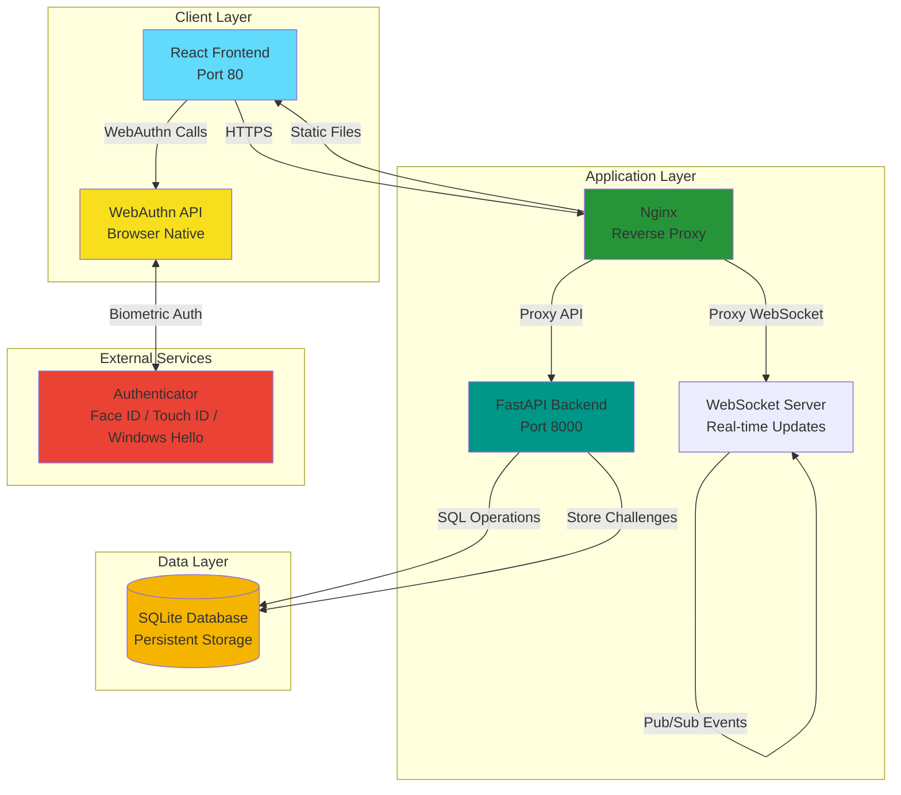
```mermaid
graph TB
    subgraph "Client Layer"
        UI[React Frontend<br/>Port 80]
        WA[WebAuthn API<br/>Browser Native]
    end

    subgraph "Application Layer"
        NGINX[Nginx<br/>Reverse Proxy]
        API[FastAPI Backend<br/>Port 8000]
        WS[WebSocket Server<br/>Real-time Updates]
    end

    subgraph "Data Layer"
        SQLite[(SQLite Database<br/>Persistent Storage)]
    end

    subgraph "External Services"
        AUTH[Authenticator<br/>Face ID / Touch ID / Windows Hello]
    end

    UI -->|HTTPS| NGINX
    NGINX -->|Static Files| UI
    NGINX -->|Proxy API| API
    NGINX -->|Proxy WebSocket| WS

    UI -->|WebAuthn Calls| WA
    WA <-->|Biometric Auth| AUTH

    API -->|SQL Operations| SQLite
    API -->|Store Challenges| SQLite
    WS -->|Pub/Sub Events| WS

    style UI fill:#61DAFB
    style WA fill:#F7DF1E
    style NGINX fill:#269539
    style API fill:#009688
    style SQLite fill:#F4B400
    style AUTH fill:#EA4335
```

---

### 2. Component Interaction Diagram

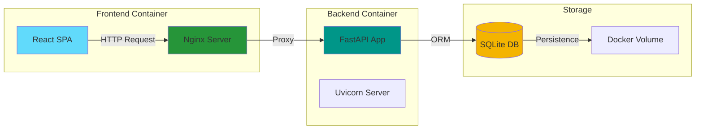
```mermaid
graph LR
    subgraph "Frontend Container"
        React[React SPA]
        Nginx[Nginx Server]
    end

    subgraph "Backend Container"
        FastAPI[FastAPI App]
        Uvicorn[Uvicorn Server]
    end

    subgraph "Storage"
        DB[(SQLite DB)]
        Vol[Docker Volume]
    end

    React -->|HTTP Request| Nginx
    Nginx -->|Proxy| FastAPI
    FastAPI -->|ORM| DB
    DB -->|Persistence| Vol

    style React fill:#61DAFB
    style Nginx fill:#269539
    style FastAPI fill:#009688
    style DB fill:#F4B400
```

---

### 3. Docker Deployment Architecture

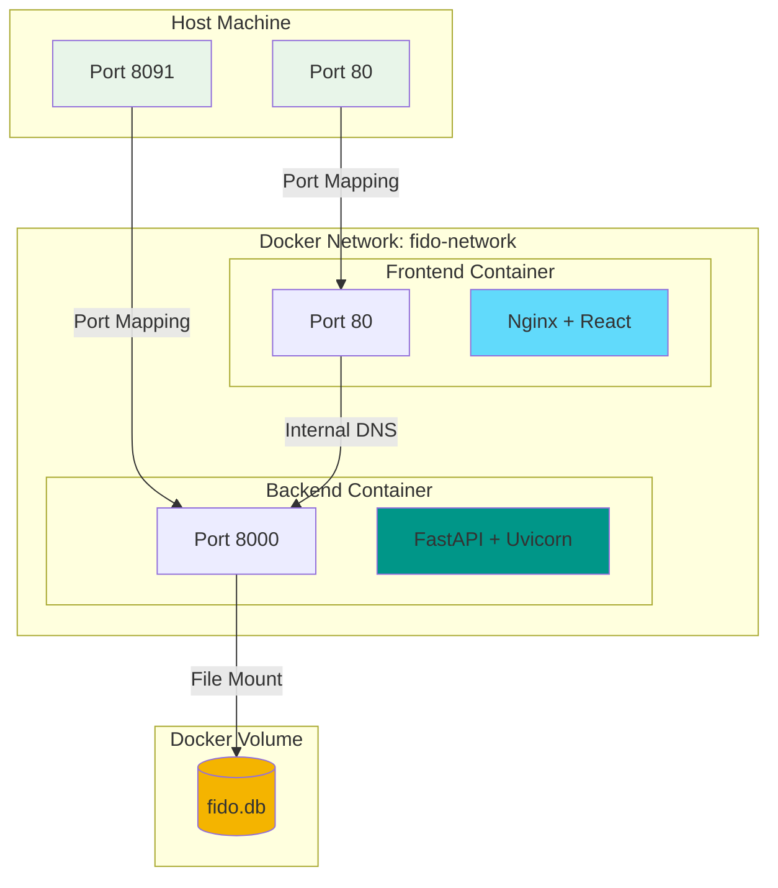
```mermaid
graph TB
    subgraph "Host Machine"
        HostPort80[Port 80]
        HostPort8091[Port 8091]
    end

    subgraph "Docker Network: fido-network"
        subgraph "Frontend Container"
            FrontendPort80[Port 80]
            Nginx[Nginx + React]
        end

        subgraph "Backend Container"
            BackendPort8000[Port 8000]
            FastAPI[FastAPI + Uvicorn]
        end
    end

    subgraph "Docker Volume"
        SQLiteDB[(fido.db)]
    end

    HostPort80 -->|Port Mapping| FrontendPort80
    HostPort8091 -->|Port Mapping| BackendPort8000

    FrontendPort80 -->|Internal DNS| BackendPort8000
    BackendPort8000 -->|File Mount| SQLiteDB

    style HostPort80 fill:#E8F5E9
    style HostPort8091 fill:#E8F5E9
    style Nginx fill:#61DAFB
    style FastAPI fill:#009688
    style SQLiteDB fill:#F4B400
```

---

## Authentication Flow Diagrams

### 4. Password Login Sequence Diagram

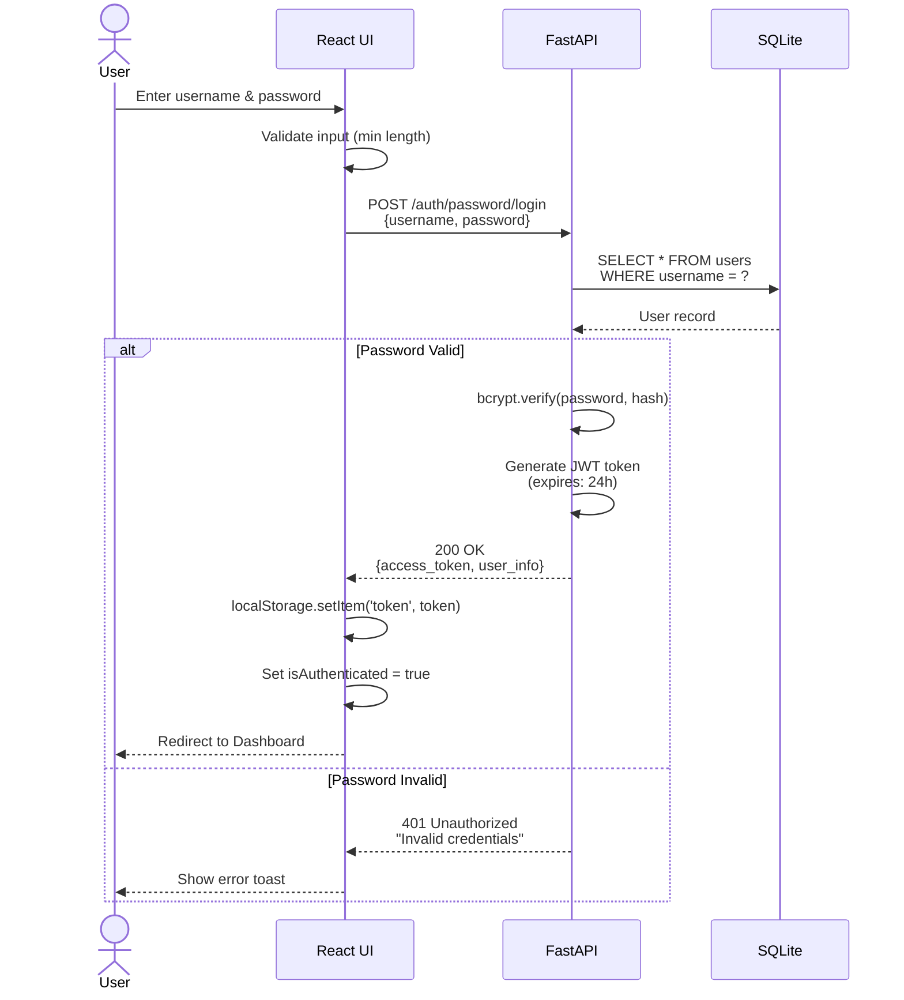
```mermaid
sequenceDiagram
    actor U as User
    participant UI as React UI
    participant API as FastAPI
    participant DB as SQLite

    U->>UI: Enter username & password
    UI->>UI: Validate input (min length)
    UI->>API: POST /auth/password/login<br/>{username, password}

    API->>DB: SELECT * FROM users<br/>WHERE username = ?
    DB-->>API: User record

    alt Password Valid
        API->>API: bcrypt.verify(password, hash)
        API->>API: Generate JWT token<br/>(expires: 24h)
        API-->>UI: 200 OK<br/>{access_token, user_info}
        UI->>UI: localStorage.setItem('token', token)
        UI->>UI: Set isAuthenticated = true
        UI-->>U: Redirect to Dashboard
    else Password Invalid
        API-->>UI: 401 Unauthorized<br/>"Invalid credentials"
        UI-->>U: Show error toast
    end
```

---

### 5. Passkey Login (With Username) Sequence Diagram

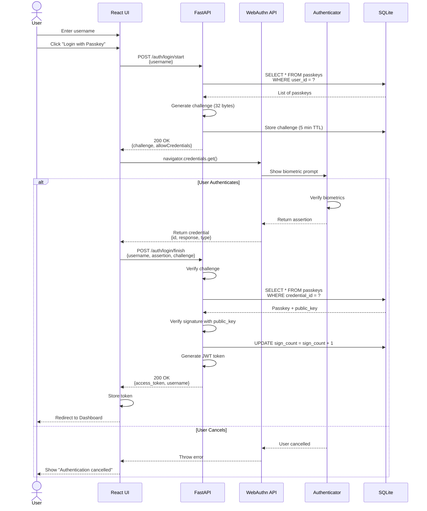
```mermaid
sequenceDiagram
    actor U as User
    participant UI as React UI
    participant API as FastAPI
    participant WA as WebAuthn API
    participant AUTH as Authenticator
    participant DB as SQLite

    U->>UI: Enter username
    U->>UI: Click "Login with Passkey"
    UI->>API: POST /auth/login/start<br/>{username}

    API->>DB: SELECT * FROM passkeys<br/>WHERE user_id = ?
    DB-->>API: List of passkeys

    API->>API: Generate challenge (32 bytes)
    API->>DB: Store challenge (5 min TTL)
    API-->>UI: 200 OK<br/>{challenge, allowCredentials}

    UI->>WA: navigator.credentials.get()
    WA->>AUTH: Show biometric prompt

    alt User Authenticates
        AUTH->>AUTH: Verify biometrics
        AUTH-->>WA: Return assertion
        WA-->>UI: Return credential<br/>{id, response, type}

        UI->>API: POST /auth/login/finish<br/>{username, assertion, challenge}

        API->>API: Verify challenge
        API->>DB: SELECT * FROM passkeys<br/>WHERE credential_id = ?
        DB-->>API: Passkey + public_key

        API->>API: Verify signature with public_key
        API->>DB: UPDATE sign_count = sign_count + 1
        API->>API: Generate JWT token
        API-->>UI: 200 OK<br/>{access_token, username}

        UI->>UI: Store token
        UI-->>U: Redirect to Dashboard
    else User Cancels
        AUTH-->>WA: User cancelled
        WA-->>UI: Throw error
        UI-->>U: Show "Authentication cancelled"
    end
```

---

### 6. Usernameless Passkey Login Sequence Diagram

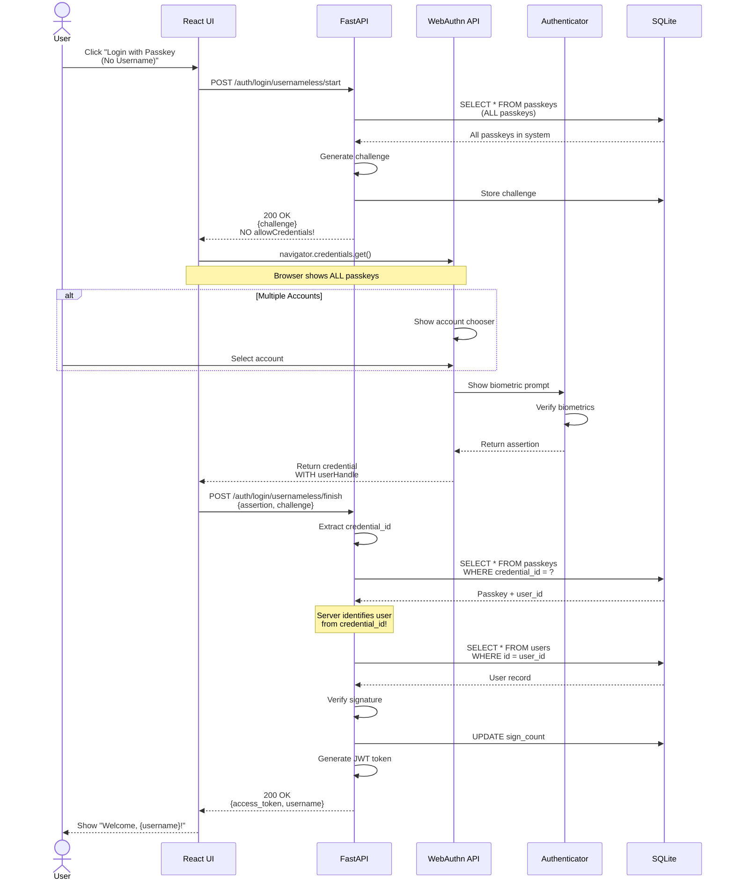
```mermaid
sequenceDiagram
    actor U as User
    participant UI as React UI
    participant API as FastAPI
    participant WA as WebAuthn API
    participant AUTH as Authenticator
    participant DB as SQLite

    U->>UI: Click "Login with Passkey<br/>(No Username)"
    UI->>API: POST /auth/login/usernameless/start

    API->>DB: SELECT * FROM passkeys<br/>(ALL passkeys)
    DB-->>API: All passkeys in system

    API->>API: Generate challenge
    API->>DB: Store challenge
    API-->>UI: 200 OK<br/>{challenge}<br/>NO allowCredentials!

    UI->>WA: navigator.credentials.get()
    Note over WA,UI: Browser shows ALL passkeys

    alt Multiple Accounts
        WA->>WA: Show account chooser
        U->>WA: Select account
    end

    WA->>AUTH: Show biometric prompt
    AUTH->>AUTH: Verify biometrics
    AUTH-->>WA: Return assertion

    WA-->>UI: Return credential<br/>WITH userHandle

    UI->>API: POST /auth/login/usernameless/finish<br/>{assertion, challenge}

    API->>API: Extract credential_id
    API->>DB: SELECT * FROM passkeys<br/>WHERE credential_id = ?
    DB-->>API: Passkey + user_id

    Note over API: Server identifies user<br/>from credential_id!

    API->>DB: SELECT * FROM users<br/>WHERE id = user_id
    DB-->>API: User record

    API->>API: Verify signature
    API->>DB: UPDATE sign_count
    API->>API: Generate JWT token
    API-->>UI: 200 OK<br/>{access_token, username}

    UI-->>U: Show "Welcome, {username}!"
```

---

## Registration Flow Diagrams

### 7. Direct Passkey Registration Sequence Diagram

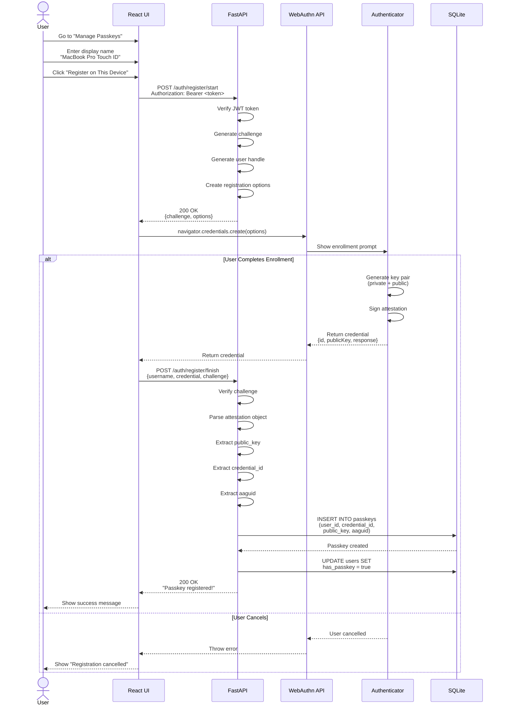
```mermaid
sequenceDiagram
    actor U as User
    participant UI as React UI
    participant API as FastAPI
    participant WA as WebAuthn API
    participant AUTH as Authenticator
    participant DB as SQLite

    U->>UI: Go to "Manage Passkeys"
    U->>UI: Enter display name<br/>"MacBook Pro Touch ID"
    U->>UI: Click "Register on This Device"
    UI->>API: POST /auth/register/start<br/>Authorization: Bearer <token>

    API->>API: Verify JWT token
    API->>API: Generate challenge
    API->>API: Generate user handle
    API->>API: Create registration options
    API-->>UI: 200 OK<br/>{challenge, options}

    UI->>WA: navigator.credentials.create(options)
    WA->>AUTH: Show enrollment prompt

    alt User Completes Enrollment
        AUTH->>AUTH: Generate key pair<br/>(private + public)
        AUTH->>AUTH: Sign attestation
        AUTH-->>WA: Return credential<br/>{id, publicKey, response}
        WA-->>UI: Return credential

        UI->>API: POST /auth/register/finish<br/>{username, credential, challenge}

        API->>API: Verify challenge
        API->>API: Parse attestation object
        API->>API: Extract public_key
        API->>API: Extract credential_id
        API->>API: Extract aaguid

        API->>DB: INSERT INTO passkeys<br/>(user_id, credential_id,<br/>public_key, aaguid)
        DB-->>API: Passkey created

        API->>DB: UPDATE users SET<br/>has_passkey = true
        API-->>UI: 200 OK<br/>"Passkey registered!"
        UI-->>U: Show success message
    else User Cancels
        AUTH-->>WA: User cancelled
        WA-->>UI: Throw error
        UI-->>U: Show "Registration cancelled"
    end
```

---

### 8. QR Code Passkey Registration Sequence Diagram

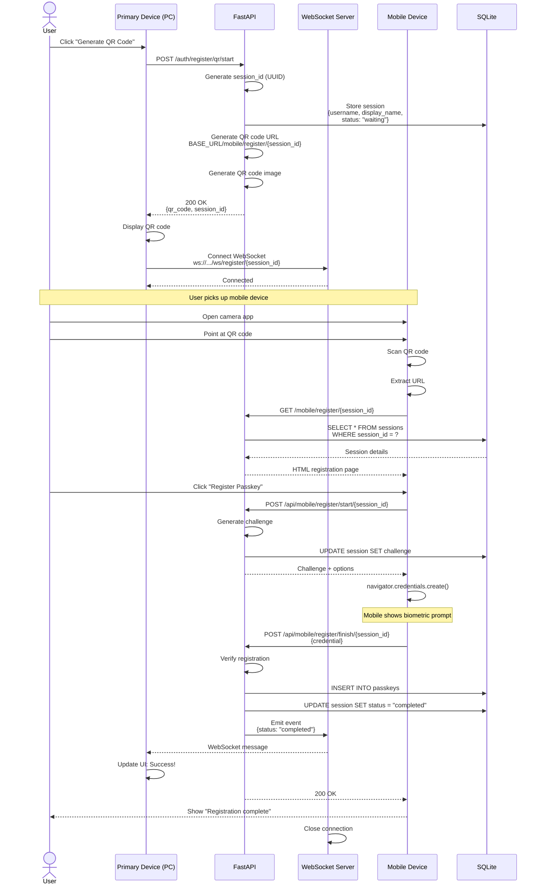
```mermaid
sequenceDiagram
    actor U as User
    participant PC as Primary Device (PC)
    participant API as FastAPI
    participant WS as WebSocket Server
    participant M as Mobile Device
    participant DB as SQLite

    U->>PC: Click "Generate QR Code"
    PC->>API: POST /auth/register/qr/start

    API->>API: Generate session_id (UUID)
    API->>DB: Store session<br/>{username, display_name,<br/>status: "waiting"}
    API->>API: Generate QR code URL<br/>BASE_URL/mobile/register/{session_id}
    API->>API: Generate QR code image
    API-->>PC: 200 OK<br/>{qr_code, session_id}

    PC->>PC: Display QR code
    PC->>WS: Connect WebSocket<br/>ws://.../ws/register/{session_id}
    WS-->>PC: Connected

    Note over U,M: User picks up mobile device

    U->>M: Open camera app
    U->>M: Point at QR code
    M->>M: Scan QR code
    M->>M: Extract URL
    M->>API: GET /mobile/register/{session_id}

    API->>DB: SELECT * FROM sessions<br/>WHERE session_id = ?
    DB-->>API: Session details
    API-->>M: HTML registration page

    U->>M: Click "Register Passkey"
    M->>API: POST /api/mobile/register/start/{session_id}
    API->>API: Generate challenge
    API->>DB: UPDATE session SET challenge
    API-->>M: Challenge + options

    M->>M: navigator.credentials.create()
    Note over M: Mobile shows biometric prompt
    M->>API: POST /api/mobile/register/finish/{session_id}<br/>{credential}

    API->>API: Verify registration
    API->>DB: INSERT INTO passkeys
    API->>DB: UPDATE session SET status = "completed"
    API->>WS: Emit event<br/>{status: "completed"}

    WS-->>PC: WebSocket message
    PC->>PC: Update UI: Success!

    API-->>M: 200 OK
    M-->>U: Show "Registration complete"

    WS->>WS: Close connection
```

---

## Database Schema Diagrams

### 9. Database Schema (ER Diagram)

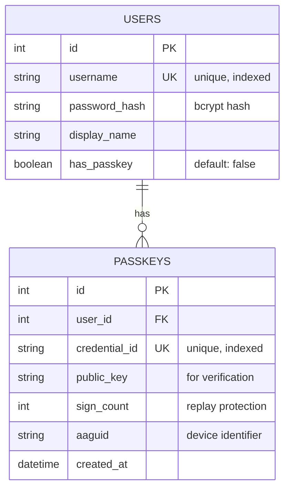
```mermaid
erDiagram
    USERS ||--o{ PASSKEYS : has

    USERS {
        int id PK
        string username UK "unique, indexed"
        string password_hash "bcrypt hash"
        string display_name
        boolean has_passkey "default: false"
    }

    PASSKEYS {
        int id PK
        int user_id FK
        string credential_id UK "unique, indexed"
        string public_key "for verification"
        int sign_count "replay protection"
        string aaguid "device identifier"
        datetime created_at
    }
```

---

### 10. Database Relationships Detail

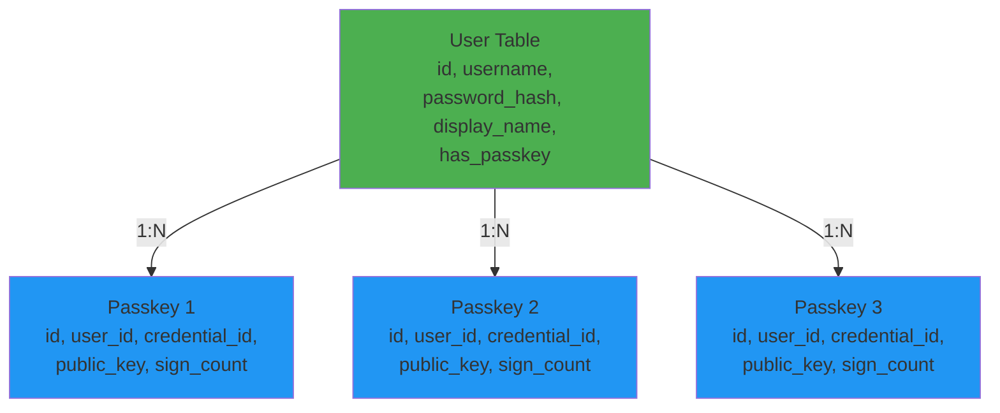
```mermaid
graph TD
    USER[User Table<br/>id, username,<br/>password_hash, display_name,<br/>has_passkey]

    PASSKEY1[Passkey 1<br/>id, user_id, credential_id,<br/>public_key, sign_count]
    PASSKEY2[Passkey 2<br/>id, user_id, credential_id,<br/>public_key, sign_count]
    PASSKEY3[Passkey 3<br/>id, user_id, credential_id,<br/>public_key, sign_count]

    USER -->|1:N| PASSKEY1
    USER -->|1:N| PASSKEY2
    USER -->|1:N| PASSKEY3

    style USER fill:#4CAF50
    style PASSKEY1 fill:#2196F3
    style PASSKEY2 fill:#2196F3
    style PASSKEY3 fill:#2196F3
```

---

## Network Diagrams

### 11. Request Flow Diagram

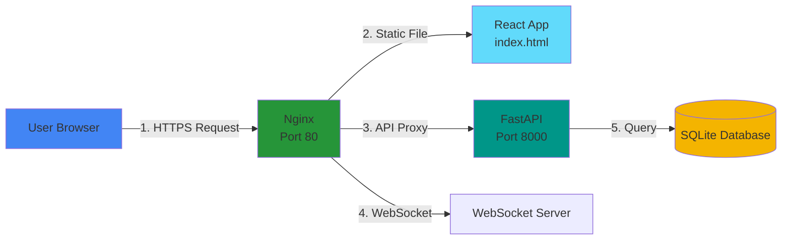
```mermaid
graph LR
    A[User Browser] -->|1. HTTPS Request| B[Nginx<br/>Port 80]
    B -->|2. Static File| C[React App<br/>index.html]
    B -->|3. API Proxy| D[FastAPI<br/>Port 8000]
    B -->|4. WebSocket| E[WebSocket Server]

    D -->|5. Query| F[(SQLite Database)]

    style A fill:#4285F4
    style B fill:#269539
    style C fill:#61DAFB
    style D fill:#009688
    style F fill:#F4B400
```

---

### 12. Container Network Diagram

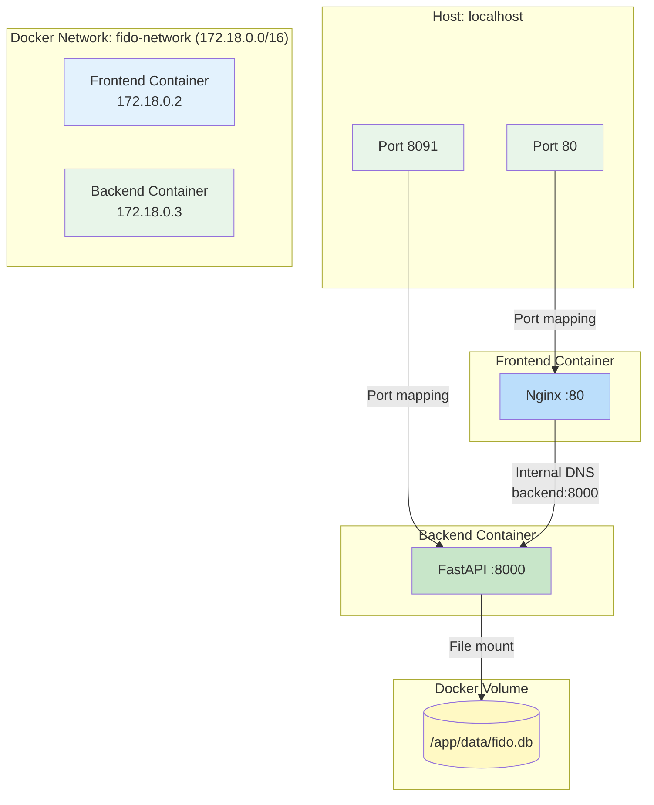
```mermaid
graph TB
    subgraph "Host: localhost"
        H80[Port 80]
        H8091[Port 8091]
    end

    subgraph "Docker Network: fido-network (172.18.0.0/16)"
        F[Frontend Container<br/>172.18.0.2]
        B[Backend Container<br/>172.18.0.3]
    end

    subgraph "Frontend Container"
        F80[Nginx :80]
    end

    subgraph "Backend Container"
        B8000[FastAPI :8000]
    end

    subgraph "Docker Volume"
        DB[("/app/data/fido.db")]
    end

    H80 -->|Port mapping| F80
    H8091 -->|Port mapping| B8000

    F80 -->|Internal DNS<br/>backend:8000| B8000

    B8000 -->|File mount| DB

    style H80 fill:#E8F5E9
    style H8091 fill:#E8F5E9
    style F fill:#E3F2FD
    style B fill:#E8F5E9
    style F80 fill:#BBDEFB
    style B8000 fill:#C8E6C9
    style DB fill:#FFF9C4
```

---

## Security Diagrams

### 13. WebAuthn Security Flow

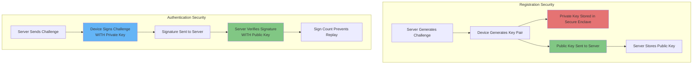
```mermaid
graph TB
    subgraph "Registration Security"
        R1[Server Generates Challenge]
        R2[Device Generates Key Pair]
        R3[Private Key Stored in Secure Enclave]
        R4[Public Key Sent to Server]
        R5[Server Stores Public Key]
    end

    subgraph "Authentication Security"
        A1[Server Sends Challenge]
        A2[Device Signs Challenge<br/>WITH Private Key]
        A3[Signature Sent to Server]
        A4[Server Verifies Signature<br/>WITH Public Key]
        A5[Sign Count Prevents Replay]
    end

    R1 --> R2
    R2 --> R3
    R2 --> R4
    R4 --> R5

    A1 --> A2
    A2 --> A3
    A3 --> A4
    A4 --> A5

    style R3 fill:#E57373
    style R4 fill:#81C784
    style A2 fill:#64B5F6
    style A4 fill:#81C784
```

---

### 14. Threat Model Mitigation

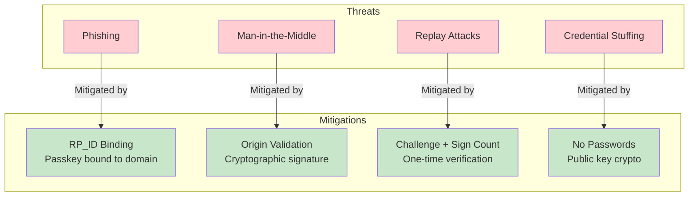
```mermaid
graph TB
    subgraph "Threats"
        T1[Phishing]
        T2[Man-in-the-Middle]
        T3[Replay Attacks]
        T4[Credential Stuffing]
    end

    subgraph "Mitigations"
        M1[RP_ID Binding<br/>Passkey bound to domain]
        M2[Origin Validation<br/>Cryptographic signature]
        M3[Challenge + Sign Count<br/>One-time verification]
        M4[No Passwords<br/>Public key crypto]
    end

    T1 -->|Mitigated by| M1
    T2 -->|Mitigated by| M2
    T3 -->|Mitigated by| M3
    T4 -->|Mitigated by| M4

    style T1 fill:#FFCDD2
    style T2 fill:#FFCDD2
    style T3 fill:#FFCDD2
    style T4 fill:#FFCDD2
    style M1 fill:#C8E6C9
    style M2 fill:#C8E6C9
    style M3 fill:#C8E6C9
    style M4 fill:#C8E6C9
```

---

## State Diagrams

### 15. User Authentication State Machine

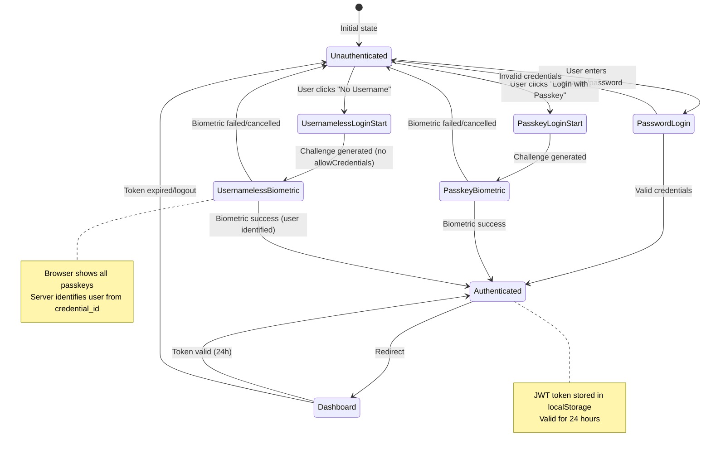
```mermaid
stateDiagram-v2
    [*] --> Unauthenticated: Initial state

    Unauthenticated --> PasswordLogin: User enters username/password
    Unauthenticated --> PasskeyLoginStart: User clicks "Login with Passkey"
    Unauthenticated --> UsernamelessLoginStart: User clicks "No Username"

    PasswordLogin --> Authenticated: Valid credentials
    PasswordLogin --> Unauthenticated: Invalid credentials

    PasskeyLoginStart --> PasskeyBiometric: Challenge generated
    PasskeyBiometric --> Authenticated: Biometric success
    PasskeyBiometric --> Unauthenticated: Biometric failed/cancelled

    UsernamelessLoginStart --> UsernamelessBiometric: Challenge generated (no allowCredentials)
    UsernamelessBiometric --> Authenticated: Biometric success (user identified)
    UsernamelessBiometric --> Unauthenticated: Biometric failed/cancelled

    Authenticated --> Dashboard: Redirect
    Dashboard --> Authenticated: Token valid (24h)
    Dashboard --> Unauthenticated: Token expired/logout

    note right of Authenticated
        JWT token stored in localStorage
        Valid for 24 hours
    end note

    note right of UsernamelessBiometric
        Browser shows all passkeys
        Server identifies user from credential_id
    end note
```

---

### 16. Passkey Registration State Machine

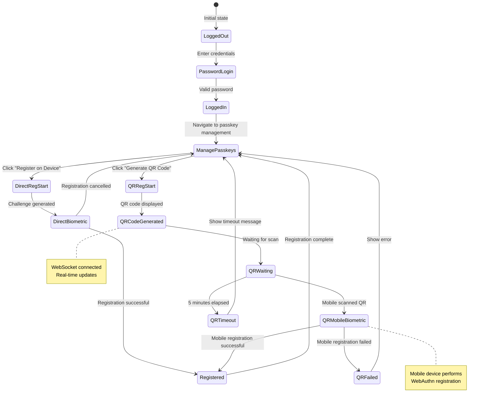
```mermaid
stateDiagram-v2
    [*] --> LoggedOut: Initial state

    LoggedOut --> PasswordLogin: Enter credentials
    PasswordLogin --> LoggedIn: Valid password

    LoggedIn --> ManagePasskeys: Navigate to passkey management

    ManagePasskeys --> DirectRegStart: Click "Register on Device"
    ManagePasskeys --> QRRegStart: Click "Generate QR Code"

    DirectRegStart --> DirectBiometric: Challenge generated
    DirectBiometric --> Registered: Registration successful
    DirectBiometric --> ManagePasskeys: Registration cancelled

    QRRegStart --> QRCodeGenerated: QR code displayed
    QRCodeGenerated --> QRWaiting: Waiting for scan
    QRWaiting --> QRMobileBiometric: Mobile scanned QR
    QRWaiting --> QRTimeout: 5 minutes elapsed

    QRMobileBiometric --> Registered: Mobile registration successful
    QRMobileBiometric --> QRFailed: Mobile registration failed

    Registered --> ManagePasskeys: Registration complete
    QRFailed --> ManagePasskeys: Show error
    QRTimeout --> ManagePasskeys: Show timeout message

    note right of QRCodeGenerated
        WebSocket connected
        Real-time updates
    end note

    note right of QRMobileBiometric
        Mobile device performs
        WebAuthn registration
    end note
```

---

## Process Flow Diagrams

### 17. Complete User Journey (First Time)

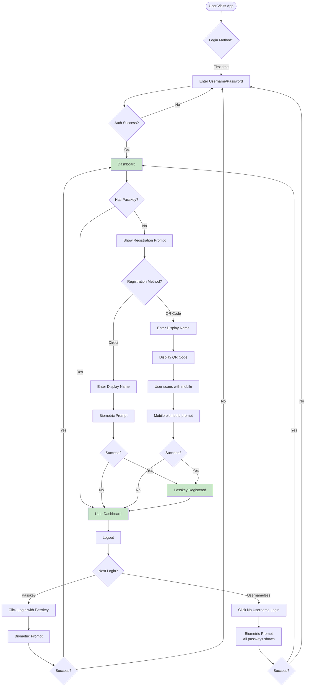
```mermaid
graph TD
    START([User Visits App]) --> LOGIN{Login Method?}

    LOGIN -->|First time| PASSWORD[Enter Username/Password]
    PASSWORD --> AUTH{Auth Success?}
    AUTH -->|No| PASSWORD
    AUTH -->|Yes| DASHBOARD[Dashboard]

    DASHBOARD --> HAS_PASSKEY{Has Passkey?}
    HAS_PASSKEY -->|No| PROMPT[Show Registration Prompt]
    HAS_PASSKEY -->|Yes| USER_DASHBOARD

    PROMPT --> REG_METHOD{Registration Method?}
    REG_METHOD -->|Direct| DIRECT_REG[Enter Display Name]
    REG_METHOD -->|QR Code| QR_REG[Enter Display Name]

    DIRECT_REG --> DIRECT_BIO[Biometric Prompt]
    DIRECT_BIO --> DIRECT_SUCCESS{Success?}
    DIRECT_SUCCESS -->|Yes| REGISTERED[Passkey Registered]
    DIRECT_SUCCESS -->|No| USER_DASHBOARD

    QR_REG --> QR_DISPLAY[Display QR Code]
    QR_DISPLAY --> QR_SCAN[User scans with mobile]
    QR_SCAN --> QR_BIO[Mobile biometric prompt]
    QR_BIO --> QR_SUCCESS{Success?}
    QR_SUCCESS -->|Yes| REGISTERED
    QR_SUCCESS -->|No| USER_DASHBOARD

    REGISTERED --> USER_DASHBOARD[User Dashboard]
    USER_DASHBOARD --> LOGOUT[Logout]
    LOGOUT --> NEXT_LOGIN{Next Login?}

    NEXT_LOGIN -->|Passkey| PASSKEY_LOGIN[Click Login with Passkey]
    NEXT_LOGIN -->|Usernameless| USERNAMELESS[Click No Username Login]

    PASSKEY_LOGIN --> PASSKEY_BIO[Biometric Prompt]
    PASSKEY_BIO --> PASSKEY_SUCCESS{Success?}
    PASSKEY_SUCCESS -->|Yes| DASHBOARD
    PASSKEY_SUCCESS -->|No| PASSWORD

    USERNAMELESS --> USERNAMELESS_BIO[Biometric Prompt<br/>All passkeys shown]
    USERNAMELESS_BIO --> USERNAMELESS_SUCCESS{Success?}
    USERNAMELESS_SUCCESS -->|Yes| DASHBOARD
    USERNAMELESS_SUCCESS -->|No| PASSWORD

    style DASHBOARD fill:#C8E6C9
    style USER_DASHBOARD fill:#C8E6C9
    style REGISTERED fill:#C8E6C9
```

---

## Deployment Diagrams

### 18. Development Environment

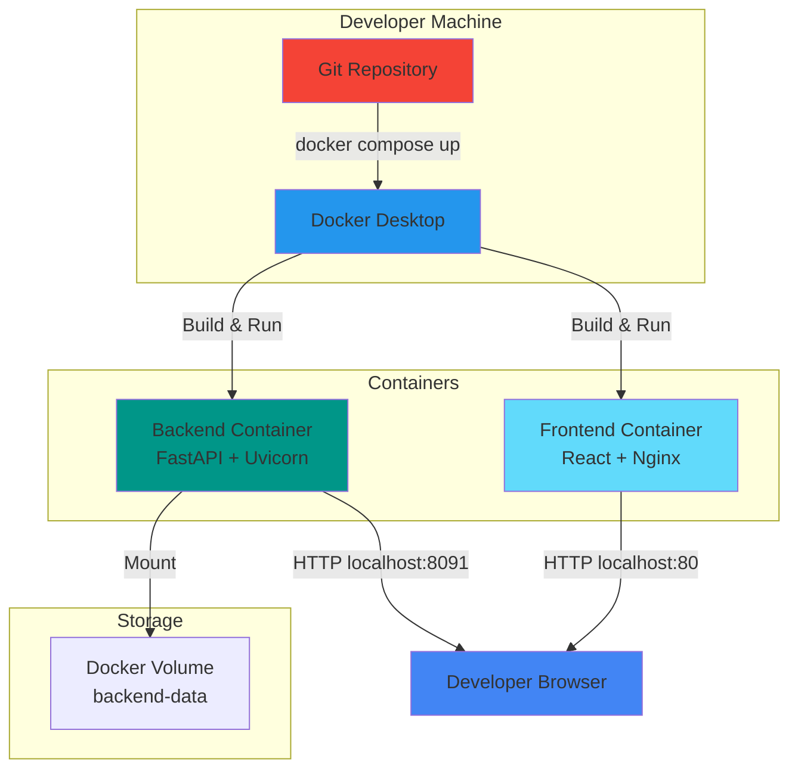
```mermaid
graph TB
    subgraph "Developer Machine"
        GIT[Git Repository]
        DOCKER[Docker Desktop]
    end

    subgraph "Containers"
        FE[Frontend Container<br/>React + Nginx]
        BE[Backend Container<br/>FastAPI + Uvicorn]
    end

    subgraph "Storage"
        VOL[Docker Volume<br/>backend-data]
    end

    GIT -->|docker compose up| DOCKER
    DOCKER -->|Build & Run| FE
    DOCKER -->|Build & Run| BE
    BE -->|Mount| VOL

    FE -->|HTTP localhost:80| BROWSER[Developer Browser]
    BE -->|HTTP localhost:8091| BROWSER

    style GIT fill:#F44336
    style DOCKER fill:#2496ED
    style FE fill:#61DAFB
    style BE fill:#009688
    style BROWSER fill:#4285F4
```

---

### 19. Production Environment (Recommended)

```mermaid
graph TB
    subgraph "Load Balancer Layer"
        LB[NGINX Load Balancer<br/>SSL Termination]
    end

    subgraph "Application Servers"
        API1[API Server 1<br/>FastAPI Instance]
        API2[API Server 2<br/>FastAPI Instance]
        API3[API Server 3<br/>FastAPI Instance]
    end

    subgraph "Database Layer"
        PG[PostgreSQL<br/>Primary]
        PG_REPL[PostgreSQL<br/>Replica]
    end

    subgraph "Cache Layer"
        REDIS[Redis Cluster<br/>Sessions + Challenges]
    end

    subgraph "CDN"
        CDN[CloudFlare/CloudFront<br/>Static Assets]
    end

    USER[User Browser] -->|HTTPS| LB
    LB -->|Distribute Load| API1
    LB -->|Distribute Load| API2
    LB -->|Distribute Load| API3

    API1 -->|Query| PG
    API2 -->|Query| PG
    API3 -->|Query| PG

    PG -->|Replication| PG_REPL

    API1 -->|Cache| REDIS
    API2 -->|Cache| REDIS
    API3 -->|Cache| REDIS

    USER -->|Static Assets| CDN

    style LB fill:#269539
    style API1 fill:#009688
    style API2 fill:#009688
    style API3 fill:#009688
    style PG fill:#336791
    style REDIS fill:#DC382D
    style CDN fill:#FF6B6B
```

---

## Comparison Diagrams

### 20. Authentication Methods Comparison

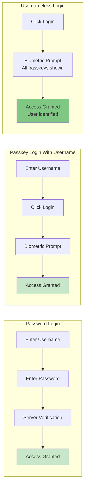
```mermaid
graph LR
    subgraph "Password Login"
        P1[Enter Username]
        P2[Enter Password]
        P3[Server Verification]
        P4[Access Granted]

        P1 --> P2 --> P3 --> P4
    end

    subgraph "Passkey Login With Username"
        PU1[Enter Username]
        PU2[Click Login]
        PU3[Biometric Prompt]
        PU4[Access Granted]

        PU1 --> PU2 --> PU3 --> PU4
    end

    subgraph "Usernameless Login"
        U1[Click Login]
        U2[Biometric Prompt<br/>All passkeys shown]
        U3[Access Granted<br/>User identified]

        U1 --> U2 --> U3
    end

    style P4 fill:#C8E6C9
    style PU4 fill:#C8E6C9
    style U3 fill:#81C784
```

---

*All diagrams created using Mermaid. For implementation details, refer to the technical documentation.*
