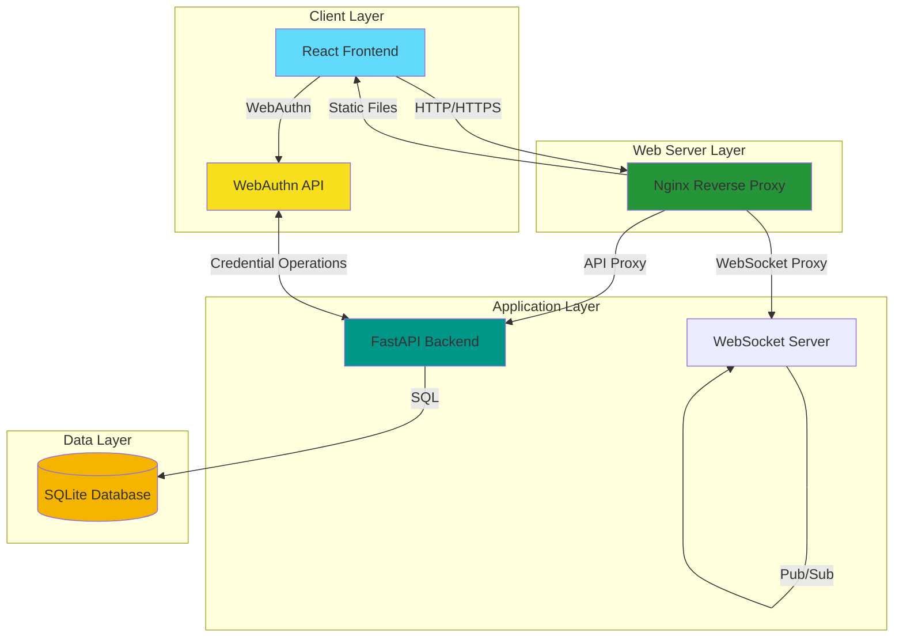
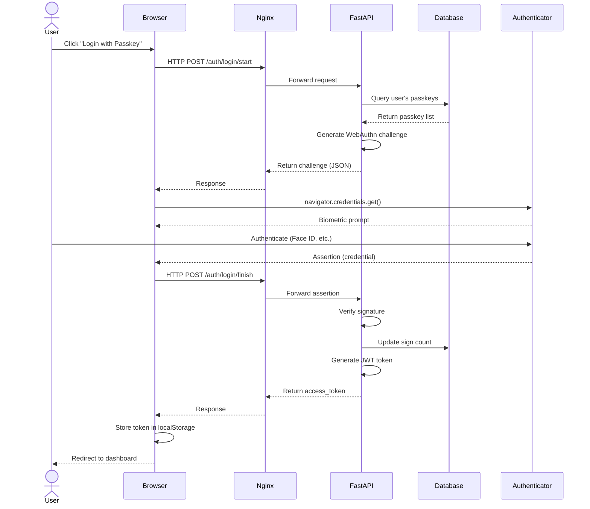
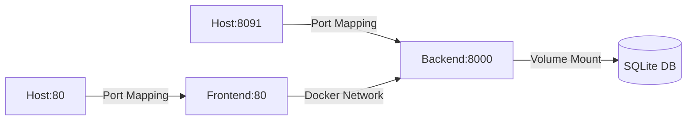
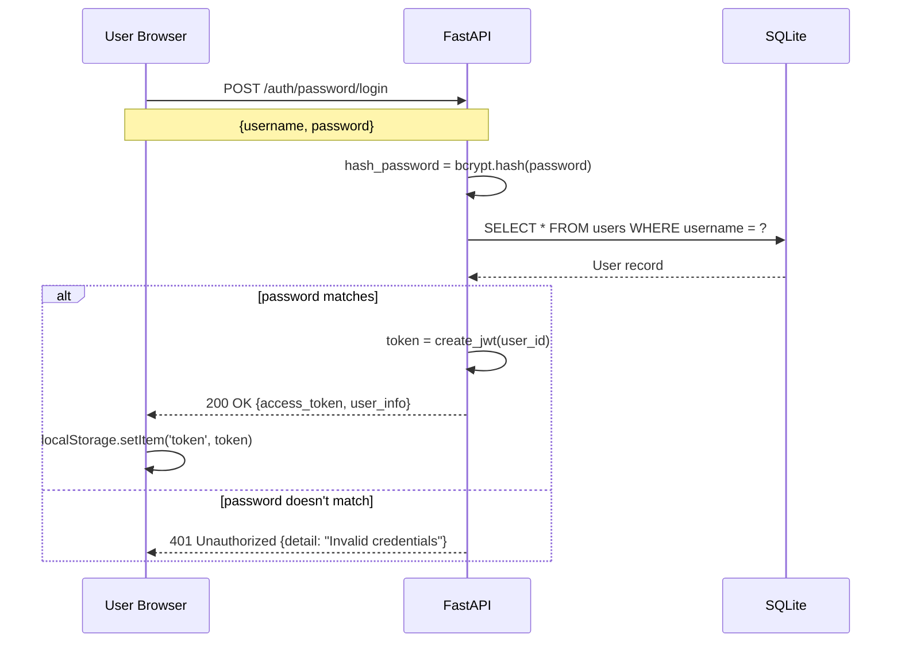
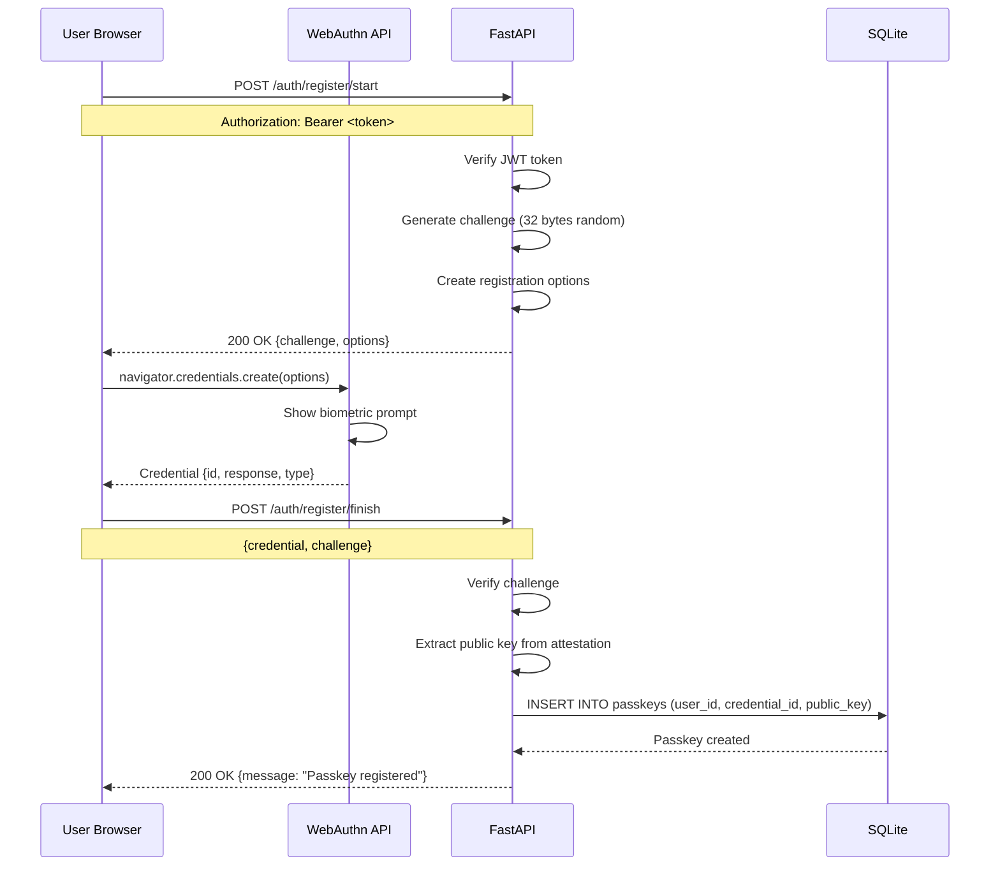
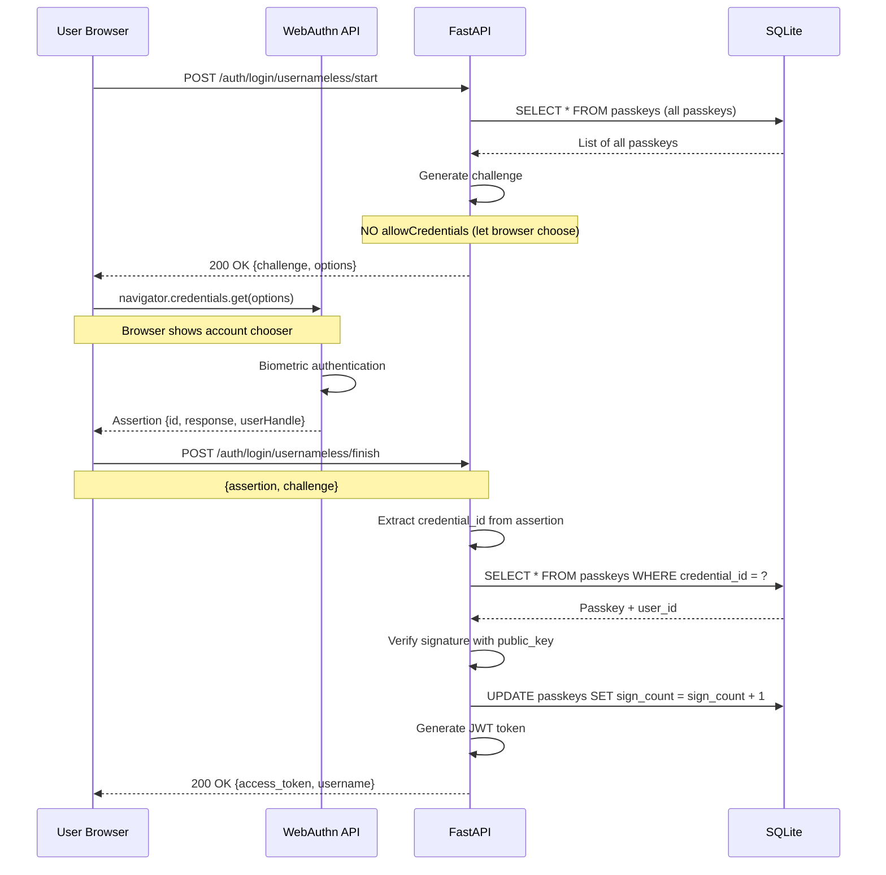
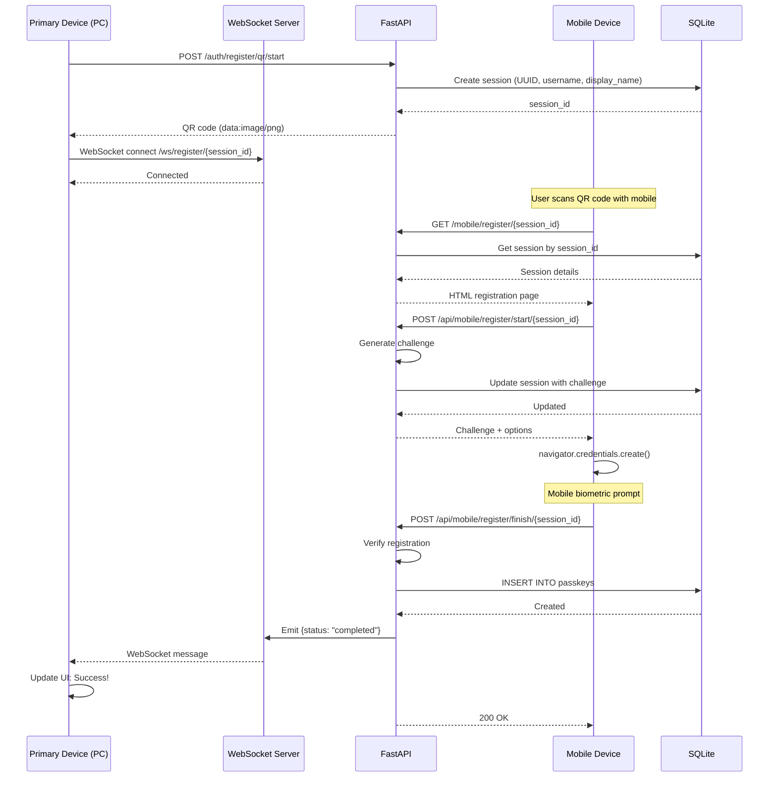

# FIDO2 Passkey Authentication System - Technical Architecture

## Document Information
- **Version:** 1.0
- **Last Updated:** 2025-12-29
- **Author:** Technical Lead
- **Project:** FIDO2 Passkey Authentication Demo

## Table of Contents
1. [System Overview](#system-overview)
2. [Technology Stack](#technology-stack)
3. [Architecture Diagrams](#architecture-diagrams)
4. [Component Details](#component-details)
5. [Data Flow](#data-flow)
6. [Security Architecture](#security-architecture)
7. [Scalability Considerations](#scalability-considerations)

---

## System Overview

The FIDO2 Passkey Authentication System is a **full-stack passwordless authentication solution** built with modern web technologies. It implements the **WebAuthn API** (W3C standard) for phishing-resistant authentication.

### Key Characteristics
- **Passwordless Primary:** Passkeys are the primary authentication method
- **Password Fallback:** Traditional password authentication for compatibility
- **Cross-Device:** QR code registration for mobile devices
- **Usernameless:** Zero-input authentication capability
- **Stateless API:** JWT tokens for session management

### High-Level Architecture



---

## Technology Stack

### Frontend Stack

| Technology | Version | Purpose |
|------------|---------|---------|
| **React** | 18.x | UI Framework |
| **Create React App** | Latest | Build tooling |
| **JavaScript** | ES2022 | Language |
| **Nginx** | Alpine | Web server |
| **Docker** | Latest | Containerization |

**Frontend Responsibilities:**
- User interface for all authentication flows
- WebAuthn API integration (navigator.credentials)
- WebSocket communication for QR code registration
- JWT token management (localStorage)
- Responsive design (mobile + desktop)

### Backend Stack

| Technology | Version | Purpose |
|------------|---------|---------|
| **Python** | 3.11 | Runtime |
| **FastAPI** | Latest | Web framework |
| **WebAuthn Library** | py_webauthn | FIDO2 implementation |
| **SQLAlchemy** | Latest | ORM |
| **SQLite** | 3.x | Database |
| **PyJWT** | Latest | JWT tokens |
| **Bcrypt** | Latest | Password hashing |
| **QRCode** | Latest | QR code generation |
| **Uvicorn** | Latest | ASGI server |
| **Docker** | Latest | Containerization |

**Backend Responsibilities:**
- REST API endpoints for authentication
- WebAuthn challenge generation and verification
- JWT token creation and validation
- Session management
- WebSocket server for real-time updates
- Passkey storage and retrieval

### Infrastructure Stack

| Technology | Purpose |
|------------|---------|
| **Docker Compose** | Multi-container orchestration |
| **Docker Networks** | Service isolation |
| **Docker Volumes** | Persistent storage |

---

## Architecture Diagrams

### Full System Architecture

```mermaid
graph TB
    subgraph "User's Device"
        Browser[Web Browser<br/>Chrome/Safari/Firefox]
        Authenticator[Authenticator<br/>Face ID / Touch ID / Windows Hello]
    end

    subgraph "Frontend Container"
        ReactApp[React SPA<br/>Port 80]
        Nginx[Nginx<br/>Static File Server]
    end

    subgraph "Backend Container"
        FastAPI[FastAPI App<br/>Port 8000]
        WebSocket[WebSocket Handler<br/>/ws/*]
    end

    subgraph "Database Volume"
        SQLiteDB[(SQLite Database<br/>/app/data/fido.db)]
    end

    Browser -->|HTTPS| Nginx
    Nginx -->|Proxy| FastAPI
    Nginx -->|WebSocket| WebSocket

    ReactApp -->|API Calls| FastAPI
    ReactApp -->|WebSocket| WebSocket

    Browser <--|WebAuthn| Authenticator

    FastAPI -->|SQLAlchemy| SQLiteDB
    WebSocket -->|Session Data| SQLiteDB

    style Browser fill:#4285F4
    style Authenticator fill:#34A853
    style ReactApp fill:#61DAFB
    style FastAPI fill:#009688
    style SQLiteDB fill:#F4B400
```

### Request Flow Architecture



---

## Component Details

### 1. Frontend Components

#### Directory Structure
```
frontend/
├── public/
│   └── index.html
├── src/
│   ├── App.js                 # Main React component
│   ├── webauthnService.js     # WebAuthn API wrapper
│   ├── index.js               # React entry point
│   └── App.css                # Styles
├── Dockerfile                 # Multi-stage build
├── nginx.conf                 # Nginx configuration
└── package.json
```

#### Key Components

**App.js** - Main Application Component
```javascript
// State Management
- username, displayName, password
- isAuthenticated, user, token
- passkeys (array of registered passkeys)
- qrCode, qrSessionId, qrStatus (for QR registration)
- activeTab (login, dashboard, manage-passkeys)

// Main Functions
- handlePasswordLogin()
- handleRegisterPasskey() - Direct registration
- handleQrRegister() - QR code registration
- handlePasskeyLogin() - With username
- handleUsernamelessLogin() - Without username
- handleDeletePasskey()
- fetchPasskeys()
```

**webauthnService.js** - WebAuthn API Integration
```javascript
// API Functions
- registerStart(username, displayName, token)
- registerFinish(username, displayName, credential, challenge, token)
- loginStart(username)
- loginFinish(username, assertion, challenge)
- loginUsernamelessStart()
- loginUsernamelessFinish(assertion, challenge)
- passwordLogin(username, password)
- getPasskeys(token)
- deletePasskey(token)
- registerQrStart(username, displayName, token)
- getQrStatus(sessionId, token)

// Helper Functions
- base64urlToBytes(base64url) - Convert to ArrayBuffer
- bytesToBase64url(bytes) - Convert to base64url string
- credentialToObject(credential) - Serialize credential
- assertionToObject(assertion) - Serialize assertion
```

#### Nginx Configuration
```nginx
server {
    listen 80;
    server_name localhost;
    root /usr/share/nginx/html;
    index index.html;

    # Serve React app
    location / {
        try_files $uri $uri/ /index.html;
    }

    # Backend API proxy
    location /auth/ {
        proxy_pass http://backend:8000/auth/;
        proxy_set_header Host $host;
        proxy_set_header X-Real-IP $remote_addr;
        proxy_set_header X-Forwarded-For $proxy_add_x_forwarded_for;
        proxy_set_header X-Forwarded-Proto $scheme;
    }

    # WebSocket support
    location /ws/ {
        proxy_pass http://backend:8000/ws/;
        proxy_http_version 1.1;
        proxy_set_header Upgrade $http_upgrade;
        proxy_set_header Connection "upgrade";
        proxy_set_header Host $host;
        proxy_read_timeout 86400;
    }
}
```

**Purpose:**
- Serves static React files
- Proxies API requests to backend
- Handles WebSocket upgrade for real-time communication

---

### 2. Backend Components

#### Directory Structure
```
backend/
├── main.py                   # FastAPI application
├── database.py               # SQLAlchemy models & DB setup
├── Dockerfile                # Python container
├── requirements.txt          # Python dependencies
└── fido.db                   # SQLite database (generated at runtime)
```

#### Key Modules

**main.py** - FastAPI Application
```python
# Configuration
RP_ID = os.getenv("RP_ID", "localhost")
RP_ORIGINS = os.getenv("RP_ORIGINS", "...").split(",")
BASE_URL = os.getenv("BASE_URL", "http://localhost")
SECRET_KEY = os.getenv("SECRET_KEY", "...")

# Middleware
- CORSMiddleware (allow all origins for demo)

# In-Memory Storage (TODO: Replace with Redis)
- challenges (dict): WebAuthn challenges
- pending_registrations (dict): QR code sessions

# Database Models
- User (id, username, password_hash, display_name, has_passkey)
- Passkey (id, user_id, credential_id, public_key, sign_count, aaguid, created_at)

# API Endpoints
Health Check:
- GET /health

Password Authentication:
- POST /auth/password/login

Passkey Registration (Direct):
- POST /auth/register/start
- POST /auth/register/finish

Passkey Registration (QR Code):
- POST /auth/register/qr/start
- GET /auth/register/qr/{session_id}
- POST /api/mobile/register/start/{session_id}
- POST /api/mobile/register/finish/{session_id}
- GET /mobile/register/{session_id} (HTML page)

Passkey Login (With Username):
- POST /auth/login/start
- POST /auth/login/finish

Passkey Login (Usernameless):
- POST /auth/login/usernameless/start
- POST /auth/login/usernameless/finish

Passkey Management:
- GET /auth/passkeys (requires auth)
- DELETE /auth/passkeys (requires auth)

User Info:
- GET /auth/me (requires auth)

WebSocket:
- WebSocket /ws/register/{session_id}
```

**database.py** - Database Models & Setup
```python
# Models
class User(Base):
    __tablename__ = "users"

    id = Column(Integer, primary_key=True, index=True)
    username = Column(String, unique=True, index=True, nullable=False)
    password_hash = Column(String, nullable=False)
    display_name = Column(String, nullable=False)
    has_passkey = Column(Boolean, default=False)
    passkeys = relationship("Passkey", back_populates="user")

class Passkey(Base):
    __tablename__ = "passkeys"

    id = Column(Integer, primary_key=True, index=True)
    user_id = Column(Integer, ForeignKey("users.id"), nullable=False)
    credential_id = Column(String, unique=True, index=True, nullable=False)
    public_key = Column(String, nullable=False)
    sign_count = Column(Integer, default=0)
    aaguid = Column(String)
    created_at = Column(DateTime, default=datetime.utcnow)
    user = relationship("User", back_populates="passkeys")

# Database Setup
- init_db(): Create tables and default user
- get_db(): Dependency injection for FastAPI
```

---

### 3. Docker Architecture

#### Docker Compose Configuration

```yaml
services:
  backend:
    build: ./backend
    container_name: fido-backend
    ports:
      - "8091:8000"
    volumes:
      - backend-data:/app/data
    environment:
      - PYTHONUNBUFFERED=1
      - BASE_URL=http://localhost:8091
      - RP_ID=localhost
      - RP_ORIGINS=http://localhost:80,...
      - SECRET_KEY=...
    networks:
      - fido-network

  frontend:
    build: ./frontend
    container_name: fido-frontend
    ports:
      - "80:80"
    depends_on:
      - backend
    networks:
      - fido-network

volumes:
  backend-data:  # Persistent database storage

networks:
  fido-network:  # Isolated service network
```

#### Container Communication



**Network Details:**
- **fido-network:** Bridge network for inter-container communication
- **Frontend → Backend:** HTTP proxy via Docker DNS (`backend:8000`)
- **Backend → Database:** File system volume mount

---

## Data Flow

### 1. Password Login Flow



### 2. Passkey Registration Flow



### 3. Usernameless Login Flow



### 4. QR Code Registration Flow



---

## Security Architecture

### 1. Authentication Layers

```
┌─────────────────────────────────────────┐
│         Application Security            │
├─────────────────────────────────────────┤
│  • JWT Token Validation                │
│  • CORS Configuration                  │
│  • Origin Validation (WebAuthn)        │
│  • Challenge Verification              │
└─────────────────────────────────────────┘
           ↓
┌─────────────────────────────────────────┐
│         WebAuthn Security              │
├─────────────────────────────────────────┤
│  • Public Key Cryptography              │
│  • Challenge-Response Protocol          │
│  • Origin Binding                       │
│  • Sign Count (Replay Protection)       │
│  • Attestation (Optional)               │
└─────────────────────────────────────────┘
           ↓
┌─────────────────────────────────────────┐
│      Device/Biometric Security         │
├─────────────────────────────────────────┤
│  • Secure Enclave (iOS/macOS)           │
│  • TEE (Android)                        │
│  • TPM (Windows)                        │
│  • Biometric Requirement                │
└─────────────────────────────────────────┘
```

### 2. Threat Mitigation

| Threat | Mitigation Strategy |
|--------|---------------------|
| **Phishing** | Passkeys are bound to RP_ID (domain), cannot be phished |
| **Man-in-the-Middle** | Origin validation + cryptographic signature verification |
| **Replay Attacks** | Challenge (one-time) + sign count (incrementing counter) |
| **Credential Stuffing** | No passwords stored (only public keys) |
| **Server Breach** | Only public keys exposed, private keys never leave devices |
| **Device Theft** | Biometric authentication required (Touch ID, Face ID, etc.) |
| **QR Code Interception** | Session expires in 5 minutes + one-time use |
| **Session Hijacking** | JWT tokens with 24-hour expiry + HTTPS (production) |

### 3. Cryptographic Overview

**Key Generation (Registration):**
```python
# Device generates key pair
private_key = secure_random_key()  # Stored on device, never exported
public_key = derive_public_key(private_key)  # Sent to server

# Server stores
credential_id = hash(public_key + rp_id + counter)
store_in_database(credential_id, public_key)
```

**Authentication (Login):**
```python
# Device signs challenge
signature = sign(private_key, challenge + client_data + auth_data)

# Server verifies
valid = verify(public_key, signature, challenge + client_data + auth_data)
```

**Signature Verification:**
- Uses ECDSA (P-256) or RSA algorithms
- Verifies data integrity
- Proves possession of private key
- Prevents tampering

---

## Scalability Considerations

### Current Architecture Limitations

| Component | Current State | Scalability Limitation |
|-----------|--------------|----------------------|
| **Database** | SQLite file-based | Single writer, no replication |
| **Challenge Storage** | In-memory dict | Lost on restart, no distributed support |
| **Session Storage** | In-memory dict | Same as challenges |
| **WebSocket** | In-memory server | No horizontal scaling |
| **File Storage** | Docker volume | Tied to single host |

### Production Recommendations

#### 1. Database Scaling

```yaml
# Replace SQLite with PostgreSQL
services:
  postgres:
    image: postgres:15
    environment:
      POSTGRES_DB: fido_auth
      POSTGRES_USER: fido_user
      POSTGRES_PASSWORD: ${DB_PASSWORD}
    volumes:
      - postgres-data:/var/lib/postgresql/data
```

**Benefits:**
- Multiple concurrent writers
- Connection pooling
- Replication and failover
- Better query performance

#### 2. Challenge/Session Storage

```python
# Replace in-memory with Redis
import redis

redis_client = redis.Redis(
    host='redis',
    port=6379,
    decode_responses=True
)

# Store challenge with TTL
redis_client.setex(
    f"challenge:{challenge_id}",
    300,  # 5 minutes
    json.dumps(challenge_data)
)
```

**Benefits:**
- Distributed across instances
- Automatic expiration (TTL)
- Persistence across restarts
- Pub/Sub for WebSocket events

#### 3. Horizontal Scaling

```yaml
services:
  backend:
    image: fido-backend:latest
    deploy:
      replicas: 3  # Multiple instances
    environment:
      - REDIS_URL=redis://redis:6379
      - DB_URL=postgresql://...
```

**Load Balancer Configuration:**
```nginx
upstream backend {
    least_conn;
    server backend-1:8000;
    server backend-2:8000;
    server backend-3:8000;
}

server {
    location /auth/ {
        proxy_pass http://backend;
    }
}
```

#### 4. WebSocket Scaling

```python
# Use Redis Pub/Sub for multi-instance WebSocket
import redis

# Publish event
redis_client.publish(
    f"ws:register:{session_id}",
    json.dumps({"status": "completed"})
)

# Subscribe to events
pubsub = redis_client.pubsub()
pubsub.subscribe(f"ws:register:{session_id}")
```

### Performance Optimization

#### Caching Strategy
```python
from functools import lru_cache

@lru_cache(maxsize=1000)
def get_user_passkeys(user_id: int):
    """Cache passkey queries"""
    return db.query(Passkey).filter(Passkey.user_id == user_id).all()
```

#### Database Indexing
```sql
CREATE INDEX idx_passkeys_credential_id ON passkeys(credential_id);
CREATE INDEX idx_passkeys_user_id ON passkeys(user_id);
CREATE INDEX idx_users_username ON users(username);
```

#### Connection Pooling
```python
# SQLAlchemy connection pool
engine = create_engine(
    DATABASE_URL,
    pool_size=20,
    max_overflow=40,
    pool_pre_ping=True  # Verify connections
)
```

---

## Monitoring & Observability (TODO)

### Metrics to Track

#### Application Metrics
- Request rate (per endpoint)
- Response time (p50, p95, p99)
- Error rate (4xx, 5xx)
- Active sessions
- Registration success rate
- Authentication success rate

#### Business Metrics
- Registration method distribution (direct vs QR)
- Device type breakdown (iOS, Android, Windows, macOS)
- Passkey usage frequency
- Login method preference
- Failed authentication reasons

#### System Metrics
- CPU usage
- Memory usage
- Disk I/O
- Network I/O
- Docker container health

### Logging Strategy

```python
import logging

# Structured logging
logging.basicConfig(
    format='%(asctime)s - %(name)s - %(levelname)s - %(message)s'
)

logger = logging.getLogger("fido-auth")

# Log authentication events
logger.info("user_login", extra={
    "user_id": user.id,
    "method": "passkey",
    "credential_id": credential_id[:20] + "...",  # Sanitize
    "success": True,
    "duration_ms": duration
})
```

---

## Deployment Architecture

### Development Environment
```yaml
Current setup:
- Docker Compose
- Single host
- HTTP (localhost)
- SQLite database
```

### Staging Environment
```yaml
Recommended:
- Docker Compose or Kubernetes
- Single host
- HTTPS with Let's Encrypt
- PostgreSQL database
- Redis for sessions
```

### Production Environment
```yaml
Recommended:
- Kubernetes (multiple replicas)
- Load balancer (NGINX/HAProxy)
- HTTPS with certificate management
- PostgreSQL with replication
- Redis Cluster
- CDN for static assets
- Monitoring (Prometheus + Grafana)
- Log aggregation (ELK/Loki)
```

---

## Next Steps & Improvements

### Immediate (Phase 2)
1. ✅ Complete API documentation
2. ✅ Add comprehensive error handling
3. ✅ Implement rate limiting
4. ✅ Add input validation/sanitization
5. ✅ HTTPS setup guide

### Short-term (Phase 3)
1. ⬜ Replace SQLite with PostgreSQL
2. ⬜ Replace in-memory with Redis
3. ⬜ Add account recovery flow
4. ⬜ Implement backup codes
5. ⬜ Add audit logging

### Long-term (Phase 4)
1. ⬜ Multi-factor authentication (MFA)
2. ⬜ Enterprise SSO integration (SAML/OIDC)
3. ⬜ Advanced passkey management
4. ⬜ Analytics dashboard
5. ⬜ A/B testing framework

---

*This document provides the technical architecture and implementation details. For API specifications, see [api-endpoints.md](api-endpoints.md). For database schema, see [database-schema.md](database-schema.md).*
