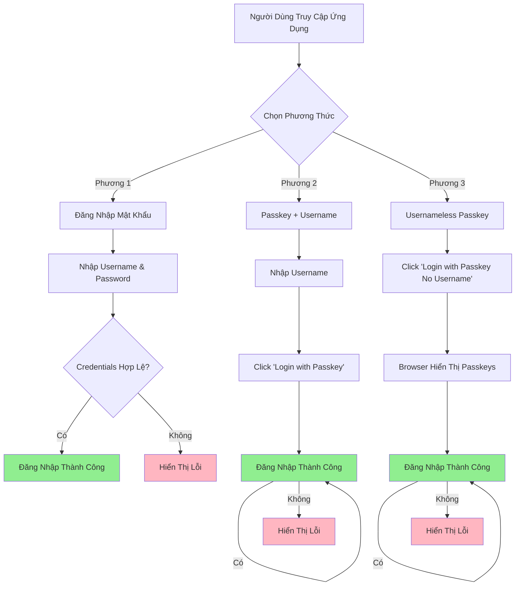

# Các Luồng Đăng Nhập - Tài Liệu Yêu Cầu Kinh Doanh

## Thông Tin Tài Liệu
- **Phiên bản:** 1.0
- **Cập nhật:** 2025-12-29
- **Tác giả:** Business Analyst
- **Dự án:** Hệ Thống FIDO2 Passkey

---

## Tổng Quan

Tài liệu này mô tả ba phương thức đăng nhập có sẵn trong Hệ Thống FIDO2 Passkey. Mỗi phương thức phục vụ các trường hợp sử dụng và sở thích người dùng khác nhau.

### So Sánh Các Phương Thức



---

## 1. Đăng Nhập Bằng Mật Khẩu

### Mục Đích Kinh Doanh
Xác thực truyền thống cho:
- Người dùng lần đầu
- Fallback khi passkey không sẵn có
- Người dùng ưu tiên mật khẩu

### Bước 1: Người Dùng Nhập Dữ Liệu
- **Username:** Bắt buộc, 3-50 ký tự
- **Password:** Bắt buộc, tối thiểu 6 ký tự

### Bước 2: Backend Xử Lý
1. Nhận username và password
2. Hash password với bcrypt
3. Truy vấn database tìm user
4. So sánh password đã hash
5. Nếu khớp: Tạo JWT token (hết hạn 24h)
6. Trả về: `{access_token, username, display_name}`

### Bước 3: Phản Hồi Thành Công
- **Status:** 200 OK
- **Trải Nghiệm:**
  - Hiển thị loading trong khi gọi API
  - Khi thành công: Chuyển hướng đến dashboard
  - Lưu token trong localStorage

### Bước 4: Xử Lý Lỗi
- **Status:** 401 Unauthorized
- **Thông Báo:** "Invalid username or password"
- **Trải Nghiệm:**
  - Hiển thị lỗi inline
  - Giữ nguyên form để thử lại
  - Gợi ý reset mật khẩu hoặc đăng ký passkey

---

## 2. Đăng Nhập Bằng Passkey (Có Username)

### Mục Đích Kinh Doanh
Xác thực không mật khẩu khi:
- Người dùng biết username
- Người dùng đã đăng ký ít nhất 1 passkey
- Người dùng muốn đăng nhập nhanh hơn/mạnh hơn mật khẩu

### Bước 1: Nhập Username
- **Username:** Bắt buộc
- **Mục Đích:** Lọc passkeys của người dùng

### Bước 2: Bắt Đầu Xác Thực
**API:** `POST /auth/login/start`

**Backend Xử Lý:**
1. Truy vấn database tìm user
2. Lấy tất cả passkey đã đăng ký của user
3. Tạo WebAuthn challenge (ngẫu nhiên)
4. Tạo authentication options với `allowCredentials` (đã lọc theo user)
5. Lưu challenge tạm thời (hết hạn 5 phút)
6. Trả về challenge + credentials

### Bước 3: Prompt WebAuthn Trên Browser
**User Experience:**
- **macOS:** Touch ID hoặc Apple Watch prompt
- **iOS:** Quét Face ID hoặc Touch ID
- **Windows:** Windows Hello (fingerprint, face, PIN)
- **Android:** Fingerprint hoặc face unlock

### Bước 4: Hoàn Thành Xác Thực
**API:** `POST /auth/login/finish`

**Backend Xử Lý:**
1. Xác thực challenge khớp với challenge đã lưu
2. Tìm passkey theo credential ID
3. Xác thực signature bằng public key
4. Kiểm tra userHandle khớp với user
5. Cập nhật sign count (chống replay)
6. Tạo JWT token
7. Trả về access token

### Lỗi Thường Gặp
| Lỗi | Nguyên Nhân | Thông Báo |
|------|-----------|-----------|
| Challenge không hợp lệ | Hết hạn hoặc không hợp lệ | "Session expired" |
| Passkey không tìm thấy | Credential ID không trong DB | "Passkey not recognized" |
| Signature không hợp lệ | Xác thực thất bại | "Authentication failed" |
| User hủy | User hủy prompt sinh trắc học | "Authentication cancelled" |

---

## 3. Đăng Nhập Passkey Không Cần Username (Usernameless)

### Mục Đích Kinh Doanh
Trải nghiệm không mật khẩu tối đa:
- Không cần username
- Đăng nhập nhanh nhất có thể
- Trải nghiệm người dùng tốt nhất
- Loại bỏ vấn đề "quên username"

### Bước 1: Khởi Tạo Usernameless
**API:** `POST /auth/login/usernameless/start`

**Backend Xử Lý:**
1. Truy vấn TẤT CẢ passkeys trong hệ thống (không lọc theo user)
2. Tạo WebAuthn challenge
3. Tạo options KHÔNG CÓ `allowCredentials` array
4. Lưu challenge tạm thời
5. Trả về challenge

**Khác Nhau Chính:** Không có `allowCredentials` - browser sẽ hiển thị TẤT CẢ passkey có sẵn

### Bước 2: Browser Hiển Thị Tất Cả Passkeys
Nếu người dùng có nhiều passkey (nhiều account), browser hiển thị chooser:

```
┌─────────────────────────────┐
│   Chọn tài khoản để đăng nhập │
│                               │
│   ┌─────────────────────────┐ │
│   │ john.doe@example.com    │ │
│   │ john.doe               │ │
│   └─────────────────────────┘ │
│   ┌─────────────────────────┐ │
│   │ jane.smith@example.com  │ │
│   │ jane.smith             │ │
│   └─────────────────────────┘ │
└─────────────────────────────┘
```

### Bước 3: Hoàn Thành Usernameless
**API:** `POST /auth/login/usernameless/finish`

**Backend Xử Lý:**
1. **Trích credential ID** từ assertion
2. **Truy vấn database** tìm passkey theo credential ID
3. **Xác định user** từ passkey (user_id)
4. **Xác thực signature** bằng public key
5. **Kiểm tra userHandle** khớp (kiểm tra privacy)
6. **Cập nhật sign count**
7. **Tạo JWT token** cho user đã xác định
8. **Trả về phản hồi cá nhân hóa**

**Success Response:**
```json
{
  "access_token": "eyJhbGciOiJIUzI1NiIsInR5cCI6IkpXVCJ9...",
  "username": "john.doe",  // Server đã xác định user!
  "has_passkey": true
}
```

### Quy Tắc Kinh Doanh
1. **Không Cần Username:** Xác thực zero-input
2. **Xác Định Account:** Server xác định user từ passkey
3. **Nhiều Account:** Nếu có nhiều account, browser hiển thị chooser
4. **Thiết Lập Trước:** User phải đăng ký passkey trước
5. **Fallback:** Luôn có sẵn password dự phòng

---

## So Sánh Các Phương Thức

### Bảng So Sánh

| Tính Năng | Mật Khẩu | Passkey + Username | Usernameless |
|-----------|----------|-------------------|--------------|
| **Input Cần Thiết** | Username + Password | Username only | Không (chỉ tap) |
| **Thiết Lập** | Tạo tài khoản | Đăng ký passkey | Đăng ký passkey |
| **Tốc Độ** | 5-10 giây | 2-3 giây | <2 giây |
| **Bảo Mật** | Trung bình (dễ bị phishing) | Cao (chống phishing) | Cao (chống phishing) |
| **UX** | ★★☆☆☆ | ★★★★☆ | ★★★★★ |
| **Yêu Cầu Thiết Bị** | Bất kỳ thiết bị nào | WebAuthn-compatible | WebAuthn-compatible |
| **Fallback** | N/A | Có (mật khẩu) | Có (mật khẩu) |

### Khi Dùng Phương Thức Nào

#### Dùng Mật Khẩu Khi:
- Lần đầu thiết lập (chưa có passkey)
- Thiết bị không hỗ trợ WebAuthn
- Passkey không sẵn có (mất thiết bị, v.v.)
- Người dùng ưu tiên phương thức truyền thống

#### Dùng Passkey + Username Khi:
- Người dùng biết username
- Người dùng muốn trải nghiệm không mật khẩu
- Người dùng có nhiều account trên cùng thiết bị
- Nhanh hơn mật khẩu, có kiểm soát hơn usernameless

#### Dùng Usernameless Khi:
- Ưu tiên trải nghiệm người dùng tốt nhất
- Người dùng không nhớ username
- Một account mỗi thiết bị (đơn giản nhất)
- Trải nghiệm mobile-first

---

## Xử Lý Lỗi

### Kịch Bản Lỗi Phổ Biến

#### 1. Chưa Có Passkey Đăng Ký
**Lỗi:** "No passkeys registered yet"

**Hành Động Người Dùng:** Xem prompt đăng ký passkey hoặc dùng mật khẩu

#### 2. Thiết Bị Không Tương Thích
**Lỗi:** "Your device doesn't support WebAuthn"

**Hành Động Người Dùng:** Cập nhật browser hoặc dùng thiết bị khác

#### 3. User Hủy Xác Thực
**Lỗi:** "Authentication cancelled by user"

**Hành Động Người Dùng:** Thử lại hoặc dùng mật khẩu

#### 4. Challenge Hết Hạn
**Lỗi:** "Session expired, please try again"

**Hành Động Người Dùng:** Khởi tạo lại luồng xác thực

#### 5. Passkey Không Được Nhận Diện
**Lỗi:** "Passkey not found"

**Hành Động Người Dùng:** Đăng ký lại passkey hoặc dùng mật khẩu

---

## Hướng Dẫn Trải Nghiệm Người Dùng

### Loading States
- **Mật khẩu:** Hiển thị spinner trong khi gọi API (<2s)
- **Passkey Start:** Hiển thị spinner (<1s)
- **Biometric Prompt:** Browser điều khiển, không cần spinner
- **Passkey Finish:** Hiển thị spinner trong khi xác thực (<2s)

### Success States
- **Mật khẩu:** Toast "Login successful!", chuyển đến dashboard
- **Passkey:** Toast "Authentication successful!", hiển thị username nếu usernameless
- **Chuyển Hướng:** Độ trễ 500ms trước khi chuyển để UX mượt

### Error Messages
- **Rõ & Hành Động Được:** Cho user biết sai gì và làm gì
- **Không Jargon Kỹ Thuật:** Tránh "401 Unauthorized" → dùng "Invalid credentials"
- **Inline Validation:** Hiển thị lỗi gần trường liên quan
- **Gợi Ý Hữu Ích:** "Try password login" hoặc "Register a passkey"

---

## Chỉ Số Thành Công

### KPI Theo Phương Thức
- **Đăng Nhập Bằng Mật Khẩu:**
  - Tỷ lệ thành công: >95%
  - Thời gian trung bình: <5 giây

- **Đăng Nhập Passkey (Có Username):**
  - Tỷ lệ thành công: >98% (cao hơn mật khẩu)
  - Thời gian trung bình: <3 giây

- **Đăng Nhập Usernameless:**
  - Tỷ lệ thành công: >99% (cao nhất)
  - Thời gian trung bình: <2 giây (nhanh nhất)

---

*Tài liệu này mô tả CÁI và TẠI SAO của các luồng đăng nhập. Để biết chi tiết triển khai, xem Tài Liệu Kỹ Thuật.*
