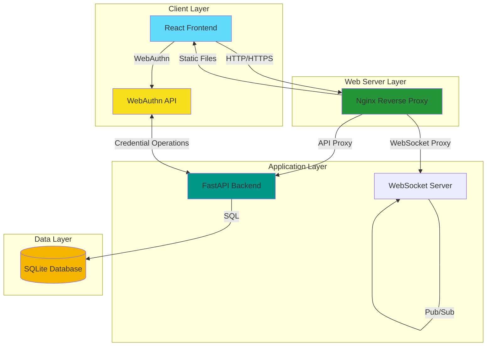

# Kiến Trúc Hệ Thống FIDO2 Passkey - Tài Liệu Kỹ Thuật

## Thông Tin Tài Liệu
- **Phiên bản:** 1.0
- **Cập nhật:** 2025-12-29
- **Tác giả:** Technical Lead
- **Dự án:** Hệ Thống FIDO2 Passkey

---

## Tổng Quan Hệ Thống

Hệ thống FIDO2 Passkey là giải pháp **xác thực không mật khẩu** full-stack sử dụng WebAuthn API hiện đại.

### Đặc Điểm Chính
- **Không Mật Khẩu Chính:** Passkey là phương thức xác thực chính
- **Dự Phòng Mật Khẩu:** Xác thực mật khẩu để tương thích
- **Cross-Device:** Đăng ký passkey qua mã QR cho thiết bị di động
- **Usernameless:** Xác thực zero-input capability
- **API Stateless:** JWT tokens cho quản lý session

---

## Stack Công Nghệ

### Frontend Stack

| Công Nghệ | Phiên Bản | Mục Đích |
|------------|-----------|----------|
| **React** | 18.x | UI Framework |
| **Create React App** | Latest | Build tooling |
| **JavaScript** | ES2022 | Language |
| **Nginx** | Alpine | Web server |
| **Docker** | Latest | Containerization |

### Backend Stack

| Công Nghệ | Phiên Bản | Mục Đích |
|------------|-----------|----------|
| **Python** | 3.11 | Runtime |
| **FastAPI** | Latest | Web framework |
| **WebAuthn Library** | py_webauthn | FIDO2 implementation |
| **SQLAlchemy** | Latest | ORM |
| **SQLite** | 3.x | Database (dev) |
| **PyJWT** | Latest | JWT tokens |
| **Bcrypt** | Latest | Password hashing |
| **QRCode** | Latest | QR generation |
| **Uvicorn** | Latest | ASGI server |

---

## Kiến Trúc Hệ Thống

### Sơ Đ Tổng Quan



---

## Chi Tiết Các Thành Phần

### 1. Frontend Components

#### Cấu Trúc Thư Mục
```
frontend/
├── src/
│   ├── App.js                 # Main React component
│   ├── webauthnService.js     # WebAuthn API wrapper
│   └── index.js
├── Dockerfile
├── nginx.conf
└── package.json
```

#### Chức Năng Chính
**App.js** - Component Chính
```javascript
// Quản lý state
- username, displayName, password
- isAuthenticated, user, token
- passkeys (mảng passkey đã đăng ký)
- qrCode, qrSessionId, qrStatus (cho QR registration)
- activeTab (login, dashboard, manage-passkeys)

// Functions chính
- handlePasswordLogin()
- handleRegisterPasskey() - Đăng ký trực tiếp
- handleQrRegister() - Đăng ký QR code
- handlePasskeyLogin() - Có username
- handleUsernamelessLogin() - Không cần username
- handleDeletePasskey()
- fetchPasskeys()
```

**webauthnService.js** - Tích Hợp WebAuthn API
```javascript
// API Functions
- registerStart(username, displayName, token)
- registerFinish(username, displayName, credential, challenge, token)
- loginStart(username)
- loginFinish(username, assertion, challenge)
- loginUsernamelessStart()
- loginUsernamelessFinish(assertion, challenge)
- passwordLogin(username, password)
- getPasskeys(token)
- deletePasskey(token)
```

---

### 2. Backend Components

#### Cấu Trúc Thư Mục
```
backend/
├── main.py                   # FastAPI application
├── database.py               # SQLAlchemy models & DB setup
├── Dockerfile
├── requirements.txt
└── fido.db                   # SQLite database (generated at runtime)
```

#### API Endpoints Chính

**Xác Thực Mật Khẩu:**
- `POST /auth/password/login`

**Đăng Ký Passkey (Trực Tiếp):**
- `POST /auth/register/start`
- `POST /auth/register/finish`

**Đăng Ký Passkey (QR Code):**
- `POST /auth/register/qr/start`
- `GET /mobile/register/{session_id}`
- `POST /api/mobile/register/start/{session_id}`
- `POST /api/mobile/register/finish/{session_id}`

**Đăng Nhập Passkey (Có Username):**
- `POST /auth/login/start`
- `POST /auth/login/finish`

**Đăng Nhập Usernameless:**
- `POST /auth/login/usernameless/start`
- `POST /auth/login/usernameless/finish`

**Quản Lý Passkey:**
- `GET /auth/passkeys` (yêu cầu auth)
- `DELETE /auth/passkeys` (yêu cầu auth)

**Thông Tin User:**
- `GET /auth/me` (yêu cầu auth)

**WebSocket:**
- `WebSocket /ws/register/{session_id}`

---

## Docker Architecture

### Docker Compose Cấu Hình

```yaml
services:
  backend:
    image: fido-demo-backend:latest
    container_name: fido-backend
    ports:
      - "8091:8000"
    volumes:
      - backend-data:/app/data
    environment:
      - BASE_URL=http://localhost:8091
      - RP_ID=localhost
      - RP_ORIGINS=http://localhost:80,...
      - SECRET_KEY=...

  frontend:
    image: fido-demo-frontend:latest
    container_name: fido-frontend
    ports:
      - "80:80"
    depends_on:
      - backend
```

### Giao Tiếp Container

```
Host (8091) → Backend Container (8000)
Host (80)   → Frontend Container (80)

Frontend → Docker Network → Backend
Backend → Volume Mount → SQLite DB
```

---

## Luồng Dữ Liệu

### 1. Password Login Flow

```
User → React UI → Nginx → FastAPI
  ↓
FastAPI → Hash password with bcrypt
  ↓
FastAPI → SQLite: Query user
  ↓
SQLite → Return user record
  ↓
FastAPI → Generate JWT token (24h expiry)
  ↓
React UI → Store token in localStorage
  ↓
React UI → Redirect to dashboard
```

### 2. Passkey Registration Flow

```
User → Click "Register Passkey"
  ↓
React UI → POST /auth/register/start
  ↓
FastAPI → Generate WebAuthn challenge
  ↓
FastAPI → Store challenge (5 min TTL)
  ↓
React UI → navigator.credentials.create()
  ↓
Browser → Show biometric enrollment
  ↓
Device → Generate key pair (private + public)
  ↓
React UI → POST /auth/register/finish
  ↓
FastAPI → Verify registration
  ↓
FastAPI → Store public key in SQLite
  ↓
FastAPI → Update user.has_passkey = true
```

### 3. Usernameless Login Flow

```
User → Click "Login with Passkey (No Username)"
  ↓
React UI → POST /auth/login/usernameless/start
  ↓
FastAPI → Get ALL passkeys (not filtered by user)
  ↓
FastAPI → Return challenge (NO allowCredentials)
  ↓
React UI → navigator.credentials.get()
  ↓
Browser → Show ALL available passkeys
  ↓
User → Select passkey + authenticate
  ↓
React UI → POST /auth/login/usernameless/finish
  ↓
FastAPI → Extract credential_id from assertion
  ↓
FastAPI → Find passkey by credential_id (identifies user!)
  ↓
FastAPI → Verify signature with public_key
  ↓
FastAPI → Generate JWT token
  ↓
React UI → Store token + Show personalized welcome
```

---

## Bảo Mật

### Các Lớp Bảo Mật

```
┌─────────────────────────────────────────┐
│         Application Security            │
├─────────────────────────────────────────┤
│  • JWT Token Validation                │
│  • CORS Configuration                  │
│  • Origin Validation (WebAuthn)        │
│  • Challenge Verification              │
└─────────────────────────────────────────┘
           ↓
┌─────────────────────────────────────────┐
│         WebAuthn Security              │
├─────────────────────────────────────────┤
│  • Public Key Cryptography              │
│  • Challenge-Response Protocol          │
│  • Origin Binding                       │
│  • Sign Count (Replay Protection)       │
└─────────────────────────────────────────┘
           ↓
┌─────────────────────────────────────────┐
│      Device/Biometric Security         │
├─────────────────────────────────────────┤
│  • Secure Enclave (iOS/macOS)           │
│  • TEE (Android)                        │
│  • TPM (Windows)                        │
│  • Biometric Requirement                │
└─────────────────────────────────────────┘
```

### Giảm Thiểu Mối Đe Dọa

| Mối Đe Dọa | Chiến Lược Giảm Thiểu |
|------------|----------------------|
| **Phishing** | Passkey gắn với RP_ID (domain), không thể bị phishing |
| **Man-in-the-Middle** | Origin validation + signature verification |
| **Replay Attacks** | Challenge (one-time) + sign count (incrementing) |
| **Credential Stuffing** | Không lưu mật khẩu (chỉ public keys) |
| **Server Breach** | Chỉ public keys bị lộ, private keys không bao giờ rời thiết bị |
| **Device Theft** | Yêu cầu sinh trắc học (Touch ID, Face ID, v.v.) |

---

## Khả Năng Mở Rộng

### Giới Hần Hiện Tại

| Thành Phần | Trạng Thái Hiện Tại | Giới Hạn Mở Rộng |
|-----------|-------------------|------------------|
| **Database** | SQLite file-based | Single writer, no replication |
| **Challenge Storage** | In-memory dict | Mất khi restart, không distributed |
| **WebSocket** | In-memory server | Không horizontal scaling |

### Khuyến Nghị Production

#### 1. Database Scaling
```yaml
# Thay SQLite bằng PostgreSQL
postgres:
  image: postgres:15
  environment:
    POSTGRES_DB: fido_auth
    POSTGRES_USER: fido_user
```

**Lợi Ích:**
- Nhiều concurrent writers
- Connection pooling
- Replication và failover
- Query performance tốt hơn

#### 2. Challenge/Session Storage
```python
# Thay in-memory bằng Redis
import redis

redis_client = redis.Redis(host='redis', port=6379)

# Store challenge với TTL
redis_client.setex(
    f"challenge:{challenge_id}",
    300,  # 5 phút
    json.dumps(challenge_data)
)
```

**Lợi Ích:**
- Distributed across instances
- Automatic expiration (TTL)
- Persistence across restarts

#### 3. Horizontal Scaling
```yaml
backend:
  deploy:
    replicas: 3  # Multiple instances
  environment:
    - REDIS_URL=redis://redis:6379
```

---

## Monitoring & Observability

### Metrics Để Theo Dõi

#### Application Metrics
- Request rate (per endpoint)
- Response time (p50, p95, p99)
- Error rate (4xx, 5xx)
- Active sessions
- Registration success rate
- Authentication success rate

#### Business Metrics
- Registration method distribution
- Device type breakdown
- Passkey usage frequency
- Login method preference

### Logging Strategy
```python
import logging

# Structured logging
logger = logging.getLogger("fido-auth")

# Log authentication events
logger.info("user_login", extra={
    "user_id": user.id,
    "method": "passkey",
    "success": True,
    "duration_ms": duration
})
```

---

## Triển Khai

### Development Environment
```bash
git clone <repo>
cd fido-demo
docker compose up --build -d
```
Access tại: http://localhost

### Production Recommendations
- **Load Balancer:** NGINX/HAProxy
- **HTTPS:** Let's Encrypt certificate
- **Database:** PostgreSQL với replication
- **Cache:** Redis Cluster
- **Monitoring:** Prometheus + Grafana
- **Logging:** ELK/Loki

---

## Bước Tiếp Theo & Cải Tiến

### Ngắn Hạn (Phase 2)
1. ✅ Hoàn thiện tài liệu API
2. ✅ Thêm error handling toàn diện
3. ✅ Triển khai rate limiting
4. ✅ Thêm input validation
5. ✅ Hướng dẫn HTTPS setup

### Trung Hạn (Phase 3)
1. ⬜ Thay SQLite bằng PostgreSQL
2. ⬜ Thay in-memory bằng Redis
3. ⬜ Thêm luồng khôi phục tài khoản
4. ⬜ Triển khai backup codes
5. ⬜ Thêm audit logging

### Dài Hạn (Phase 4)
1. ⬜ MFA (multi-factor authentication)
2. ⬜ Enterprise SSO integration (SAML/OIDC)
3. ⬜ Advanced passkey management
4. ⬜ Analytics dashboard
5. ⬜ A/B testing framework

---

*Tài liệu này cung cấp kiến trúc và chi tiết triển khai. Để biết spec API, xem [api-endpoints.md](api-endpoints.md).*
